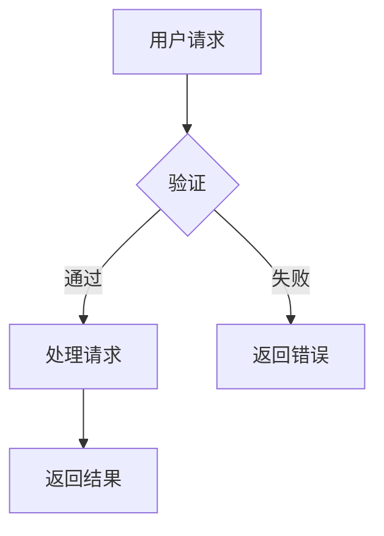

# feishu-cli

飞书开放平台命令行工具，**核心功能是 Markdown ↔ 飞书文档双向转换**，支持文档、知识库、消息、日历、任务等全功能操作。

## 核心特性：Markdown 与飞书文档互转

**feishu-cli 最强大的功能是 Markdown 和飞书文档的双向转换**，特别适合：

- **技术文档发布**：将本地 Markdown 文档一键上传到飞书
- **Mermaid 图表渲染**：Mermaid 代码块自动转换为飞书画板（推荐使用 Mermaid 画图）
- **表格自动处理**：超大表格自动拆分（飞书限制单表格最多 9 行）
- **文档备份**：将飞书文档导出为标准 Markdown

### 快速体验

```bash
# 从 Markdown 创建飞书文档（支持 mermaid 图表、表格）
feishu-cli doc import report.md --title "技术分析报告" --verbose

# 导出飞书文档为 Markdown
feishu-cli doc export <document_id> -o doc.md --download-images
```

### Mermaid 图表支持

**推荐在文档中使用 Mermaid 画图**，导入时会自动转换为飞书画板：

````markdown

````

支持的 Mermaid 图表类型（全部已验证）：
- ✅ 流程图 (flowchart) - 支持 subgraph
- ✅ 时序图 (sequenceDiagram)
- ✅ 类图 (classDiagram)
- ✅ 状态图 (stateDiagram-v2)
- ✅ ER 图 (erDiagram)
- ✅ 甘特图 (gantt)
- ✅ 饼图 (pie)

### 大规模文档测试

已验证可成功导入的大型文档（2026-01-27）：
- **10,000+ 行 Markdown**
- **77 个 Mermaid 图表** → 全部成功转换为飞书画板
- **236 个表格** → 自动拆分处理，全部成功
- **20 种图表类型测试** → flowchart/sequenceDiagram/classDiagram/stateDiagram/erDiagram/gantt/pie 全部成功

## 项目定位

本项目提供两种使用方式：

1. **命令行工具** - 直接在终端使用 `feishu-cli` 命令操作飞书
2. **AI 技能集** - 为 [Claude Code](https://claude.ai/claude-code) 等 AI 编程助手提供飞书操作能力

### AI 技能 (skills/)

`skills/` 目录包含为 AI 编程助手设计的技能文件，让 AI 能够直接操作飞书：

```
skills/
├── feishu-cli-read/      # 读取飞书文档/知识库
├── feishu-cli-write/     # 写入/更新文档
├── feishu-cli-create/    # 创建空白文档
├── feishu-cli-export/    # 导出为 Markdown
├── feishu-cli-import/    # 从 Markdown 导入
├── feishu-cli-wiki/      # 知识库操作
├── feishu-cli-sheet/     # 电子表格（V2/V3 API、富文本）
├── feishu-cli-file/      # 云空间文件管理
├── feishu-cli-media/     # 素材上传/下载
├── feishu-cli-comment/   # 文档评论
├── feishu-cli-calendar/  # 日历日程管理
├── feishu-cli-task/      # 任务管理
└── feishu-cli-search/    # 搜索消息/应用
```

**使用方法**：将 `skills/` 目录复制到你的项目中，AI 助手即可通过 `/feishu-cli-xxx` 命令操作飞书。

## 功能特性

| 模块 | 功能 |
|------|------|
| 文档 | 创建、获取、编辑、删除文档及块内容 |
| 知识库 | 获取、创建、更新、移动、删除节点 |
| Markdown | 飞书文档 ↔ Markdown 双向转换 |
| **电子表格** | 创建、读写、行列操作、样式、筛选、V3 富文本 API |
| 文件 | 列出、创建、移动、复制、删除云空间文件 |
| 素材 | 上传和下载图片、文件 |
| 权限 | 添加/更新协作者权限 |
| 评论 | 列出、添加文档评论 |
| 消息 | 发送、获取、删除、转发消息 |
| 日历 | 创建、查询、更新、删除日程 |
| 任务 | 创建、查询、更新、删除、完成任务 |
| 搜索 | 搜索消息和应用 |

支持 40+ 种飞书文档块类型的完整转换。

## 安装

### 使用 go install（推荐）

```bash
go install github.com/riba2534/feishu-cli@main
```

### 从源码编译

```bash
git clone https://github.com/riba2534/feishu-cli.git
cd feishu-cli
go build -o feishu-cli .
```

### 下载预编译版本

从 [Releases](https://github.com/riba2534/feishu-cli/releases) 页面下载对应平台的可执行文件。

## 配置

### 1. 获取应用凭证

1. 访问 [飞书开放平台](https://open.feishu.cn/app) 创建应用
2. 获取 App ID 和 App Secret
3. 配置应用权限（文档、消息等）

### 2. 设置凭证

**方式一：环境变量（推荐）**

```bash
export FEISHU_APP_ID="cli_xxx"
export FEISHU_APP_SECRET="xxx"
```

**方式二：配置文件**

```bash
feishu-cli config init
# 编辑 ~/.feishu-cli/config.yaml
```

```yaml
app_id: "cli_xxx"
app_secret: "xxx"
```

**优先级**: 环境变量 > 配置文件 > 默认值

## 快速开始

```bash
# 创建文档
feishu-cli doc create --title "我的文档"

# 导出文档为 Markdown
feishu-cli doc export <document_id> -o doc.md

# 从 Markdown 创建文档
feishu-cli doc import doc.md --title "导入的文档"

# 发送消息
feishu-cli msg send --receive-id-type email --receive-id user@example.com --text "Hello"
```

## 命令概览

```
feishu-cli [命令] [子命令] [选项]

命令:
  doc       文档操作（创建、获取、编辑、导入导出、高亮块、画板）
  wiki      知识库操作（节点增删改查）
  sheet     电子表格（V2/V3 API、富文本、行列操作、样式）
  user      用户操作（获取用户信息）
  board     画板操作（下载图片、导入图表、创建节点）
  file      文件管理（列出、创建、移动、复制、删除）
  media     素材操作（上传、下载）
  comment   评论操作（列出、添加）
  perm      权限操作（添加、更新）
  msg       消息操作（发送、获取、删除、转发、搜索群聊、历史消息）
  calendar  日历操作（日程增删改查）
  task      任务操作（增删改查、完成）
  search    搜索操作（消息、应用）
  config    配置管理
```

## 文档操作

### 创建文档

```bash
feishu-cli doc create --title "我的文档"
feishu-cli doc create --title "我的文档" --folder <folder_token>
```

### 获取文档

```bash
feishu-cli doc get <document_id>
feishu-cli doc blocks <document_id>
```

### 编辑文档

```bash
# 添加内容（JSON 格式）
feishu-cli doc add <document_id> --content '[{"block_type":2,"text":{"elements":[{"text_run":{"content":"Hello"}}]}}]'

# 添加内容（Markdown 格式）
feishu-cli doc add <document_id> README.md --content-type markdown
feishu-cli doc add <document_id> --content "# 标题\n正文内容" --content-type markdown

# 获取所有块（自动分页）
feishu-cli doc blocks <document_id> --all

# 批量更新块
feishu-cli doc batch-update <document_id> '[{"block_id":"xxx","update_text_elements":{"elements":[...]}}]' --source-type content

# 更新块
feishu-cli doc update <document_id> <block_id> --content '{"update_text_elements":{...}}'

# 删除块
feishu-cli doc delete <document_id> <parent_block_id> --start 1 --end 3
```

### 高亮块和画板

```bash
# 添加高亮块（Callout）
feishu-cli doc add-callout <document_id> "提示内容" --callout-type info
feishu-cli doc add-callout <document_id> "警告内容" --callout-type warning
feishu-cli doc add-callout <document_id> "错误内容" --callout-type error
feishu-cli doc add-callout <document_id> "成功内容" --callout-type success

# 添加画板到文档
feishu-cli doc add-board <document_id>
```

## Markdown 转换（核心功能）

### 从 Markdown 导入（推荐使用）

```bash
# 基本导入
feishu-cli doc import doc.md --title "新文档"

# 导入到已有文档（追加内容）
feishu-cli doc import doc.md --document-id <document_id>

# 详细模式（显示进度）
feishu-cli doc import doc.md --title "技术报告" --verbose
```

**导入特性：**
- **Mermaid 图表** → 自动转换为飞书画板
- **超大表格** → 自动拆分（飞书限制单表最多 9 行）
- **代码块** → 保留语法高亮
- **本地图片** → 自动上传（`--upload-images`）

### 导出为 Markdown

```bash
# 基本导出
feishu-cli doc export <document_id>

# 导出并下载图片
feishu-cli doc export <document_id> -o doc.md --download-images
```

**导出特性：**
- 飞书画板 → 生成画板链接
- 表格、代码块 → 标准 Markdown 格式
- 图片 → 可选下载到本地

### 最佳实践

1. **写文档时使用 Mermaid 画图**（而非截图）
2. 表格尽量简洁，超过 9 行会被自动拆分
3. 大文档导入使用 `--verbose` 查看进度

## 知识库操作

```bash
# 列出知识空间
feishu-cli wiki spaces

# 获取节点
feishu-cli wiki get <node_token>
feishu-cli wiki get https://xxx.feishu.cn/wiki/<node_token>

# 导出为 Markdown
feishu-cli wiki export <node_token> -o doc.md

# 创建/更新/删除/移动节点
feishu-cli wiki create --space-id <space_id> --title "新节点"
feishu-cli wiki update <node_token> --title "新标题"
feishu-cli wiki delete <node_token>
feishu-cli wiki move <node_token> --target-space <target_space_id>
```

## 用户操作

```bash
# 获取用户信息
feishu-cli user info <user_id>
feishu-cli user info <user_id> --user-id-type user_id
feishu-cli user info <user_id> -o json
```

## 画板操作

```bash
# 下载画板图片
feishu-cli board image <whiteboard_id> output.png

# 导入图表到画板
feishu-cli board import <whiteboard_id> diagram.puml --syntax plantuml
feishu-cli board import <whiteboard_id> diagram.mmd --syntax mermaid

# 创建画板节点
feishu-cli board create-notes <whiteboard_id> nodes.json
```

## 电子表格操作

### 基本操作

```bash
# 创建电子表格
feishu-cli sheet create --title "销售数据"

# 获取表格信息
feishu-cli sheet get <spreadsheet_token>

# 列出工作表
feishu-cli sheet list-sheets <spreadsheet_token>
```

### 单元格读写（V2 API）

```bash
# 读取单元格
feishu-cli sheet read <spreadsheet_token> "Sheet1!A1:C10"

# 写入单元格
feishu-cli sheet write <spreadsheet_token> "Sheet1!A1:B2" \
  --data '[["姓名","年龄"],["张三",25]]'

# 追加数据
feishu-cli sheet append <spreadsheet_token> "Sheet1!A:B" \
  --data '[["新行1","数据1"],["新行2","数据2"]]'
```

### 富文本操作（V3 API）

V3 API 支持富文本内容，包括 @用户、@文档、图片、链接、公式等元素类型。

```bash
# 获取纯文本内容（批量）
feishu-cli sheet read-plain <token> <sheet_id> "sheet!A1:C10" "sheet!E1:E5"

# 获取富文本内容（返回结构化数据）
feishu-cli sheet read-rich <token> <sheet_id> "sheet!A1:C10" -o json

# 写入富文本（从文件）
feishu-cli sheet write-rich <token> <sheet_id> --data-file data.json

# 插入数据（在指定位置上方插入行）
feishu-cli sheet insert <token> <sheet_id> "sheet!A2:B2" \
  --data '[["新数据1","新数据2"]]' --simple

# 追加富文本数据
feishu-cli sheet append-rich <token> <sheet_id> "sheet!A1:B1" \
  --data '[["追加数据"]]' --simple

# 清除单元格内容（保留样式）
feishu-cli sheet clear <token> <sheet_id> "sheet!A1:B3"
```

**V3 富文本数据格式示例：**

```json
[
  {
    "range": "Sheet1!A1:B2",
    "values": [
      [
        [{"type": "text", "text": {"text": "标题"}}],
        [{"type": "value", "value": {"value": "100"}}]
      ],
      [
        [{"type": "text", "text": {"text": "内容", "segment_style": {"style": {"bold": true}}}}],
        [{"type": "formula", "formula": {"formula": "=SUM(A1:A10)"}}]
      ]
    ]
  }
]
```

**支持的元素类型：**
- `text` - 文本（支持局部样式：粗体、斜体、颜色等）
- `value` - 数值
- `date_time` - 日期时间
- `mention_user` - @用户
- `mention_document` - @文档
- `image` - 图片
- `file` - 附件
- `link` - 链接
- `formula` - 公式
- `reminder` - 提醒

### 行列操作

```bash
feishu-cli sheet add-rows <token> <sheet_id> -n 5       # 添加 5 行
feishu-cli sheet add-cols <token> <sheet_id> -n 3       # 添加 3 列
feishu-cli sheet insert-rows <token> <sheet_id> --start 2 --count 3  # 插入行
feishu-cli sheet delete-rows <token> <sheet_id> --start 0 --end 5
feishu-cli sheet delete-cols <token> <sheet_id> --start 0 --end 3
```

### 格式和样式

```bash
# 合并单元格
feishu-cli sheet merge <token> "Sheet1!A1:C3"
feishu-cli sheet unmerge <token> "Sheet1!A1:C3"

# 设置样式
feishu-cli sheet style <token> "Sheet1!A1:C3" --bold --bg-color "#FFFF00"

# 查找替换
feishu-cli sheet find <token> <sheet_id> "关键词"
feishu-cli sheet replace <token> <sheet_id> "旧值" "新值"
```

### 工作表管理

```bash
feishu-cli sheet add-sheet <token> --title "新工作表"
feishu-cli sheet delete-sheet <token> <sheet_id>
feishu-cli sheet copy-sheet <token> <sheet_id> --title "副本"
```

## 文件管理

```bash
feishu-cli file list [folder_token]
feishu-cli file mkdir "新文件夹" --parent <folder_token>
feishu-cli file move <file_token> --target <folder_token> --type docx
feishu-cli file copy <file_token> --target <folder_token> --type docx
feishu-cli file delete <file_token> --type docx
```

## 消息操作

```bash
# 发送文本消息
feishu-cli msg send --receive-id-type email --receive-id user@example.com --text "Hello"

# 发送到群组
feishu-cli msg send --receive-id-type chat_id --receive-id oc_xxx --text "群消息"

# 搜索群聊
feishu-cli msg search-chats
feishu-cli msg search-chats --query "关键词" --page-size 20

# 获取会话历史消息
feishu-cli msg history --container-id <chat_id> --container-id-type chat

# 其他操作
feishu-cli msg get <message_id>
feishu-cli msg list --container-id <chat_id>
feishu-cli msg delete <message_id>
feishu-cli msg forward <message_id> --receive-id <id> --receive-id-type email
```

## 日历操作

```bash
feishu-cli calendar list
feishu-cli calendar create-event --calendar-id <id> --summary "会议" --start-time "2024-01-15 14:00:00" --end-time "2024-01-15 15:00:00"
feishu-cli calendar list-events <calendar_id>
feishu-cli calendar update-event --calendar-id <id> --event-id <id> --summary "新标题"
feishu-cli calendar delete-event <calendar_id> <event_id>
```

## 任务操作

```bash
feishu-cli task create --summary "待办事项"
feishu-cli task list
feishu-cli task get <task_id>
feishu-cli task update <task_id> --summary "新标题"
feishu-cli task complete <task_id>
feishu-cli task delete <task_id>
```

## 权限管理

```bash
feishu-cli perm add <document_id> \
  --doc-type docx \
  --member-type email \
  --member-id user@example.com \
  --perm edit
```

权限级别: `view` | `edit` | `full_access`

## 素材操作

```bash
feishu-cli media upload image.png --parent-type doc_image --parent-node <document_id>
feishu-cli media download <file_token> --output image.png
```

## 搜索操作

```bash
# 搜索消息（需要 User Access Token）
feishu-cli search messages "关键词"

# 搜索应用
feishu-cli search apps "应用名"
```

## 块类型支持

| 类型 | 名称 | Markdown |
|------|------|----------|
| 2 | Text | 段落 |
| 3-11 | Heading1-9 | `#` ~ `######` |
| 12 | Bullet | `- item` |
| 13 | Ordered | `1. item` |
| 14 | Code | ` ```lang ``` ` |
| 15 | Quote | `> text` |
| 16 | Equation | `$$formula$$` |
| 17 | Todo | `- [ ]` / `- [x]` |
| 19 | Callout | `> [!NOTE]` |
| 21 | Diagram | Mermaid |
| 22 | Divider | `---` |
| 27 | Image | `` |
| 31 | Table | Markdown 表格 |
| 43 | Board | 画板 |

还支持 Bitable、Sheet、File、Grid、ISV 等 40+ 种块类型。

## 完整工作流示例

```bash
# 1. 设置凭证
export FEISHU_APP_ID="cli_xxx"
export FEISHU_APP_SECRET="xxx"

# 2. 创建文档并获取 ID
DOC_ID=$(feishu-cli doc create --title "API文档" --output json | jq -r '.document_id')

# 3. 导入 Markdown 内容
feishu-cli doc import README.md --document-id $DOC_ID --upload-images

# 4. 添加协作者
feishu-cli perm add $DOC_ID --doc-type docx --member-type email --member-id colleague@example.com --perm edit

# 5. 发送通知
feishu-cli msg send --receive-id-type email --receive-id colleague@example.com --text "文档已创建"
```

## 开发

```bash
go mod tidy
go test ./...
go vet ./...
go build -o feishu-cli .
```

## 许可证

MIT License
