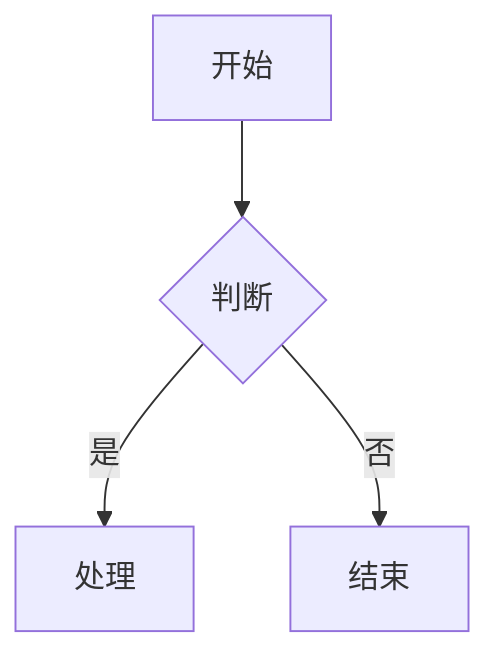

# feishu-cli

[](https://go.dev/)
[](LICENSE)
[](https://github.com/riba2534/feishu-cli/releases)

飞书开放平台命令行工具 - **Markdown 与飞书文档双向转换**，支持文档、知识库、电子表格、消息、日历、任务等全功能操作。

## 特性

- **Markdown ↔ 飞书文档** - 双向无损转换，支持 40+ 种块类型
- **Mermaid/PlantUML 图表** - 自动转换为飞书画板，支持 7 种 Mermaid + PlantUML 全类型
- **智能表格处理** - 列宽自动计算，大表格自动拆分
- **完整 API 覆盖** - 文档、知识库、表格、消息、日历、任务、权限等
- **AI 技能集成** - 为 Claude Code 等 AI 助手提供飞书操作能力

## 快速开始

### 安装

**方式一：一键安装（推荐）**

自动检测平台，下载最新版本并安装到 `/usr/local/bin`：

```bash
curl -fsSL https://raw.githubusercontent.com/riba2534/feishu-cli/main/install.sh | bash
```

已安装的用户执行同样的命令即可更新到最新版本。

**方式二：手动下载**

从 [Releases](https://github.com/riba2534/feishu-cli/releases/latest) 页面下载对应平台的压缩包：

| 平台 | 文件 |
|------|------|
| Linux x64 | `feishu-cli_*_linux-amd64.tar.gz` |
| Linux ARM64 | `feishu-cli_*_linux-arm64.tar.gz` |
| macOS Intel | `feishu-cli_*_darwin-amd64.tar.gz` |
| macOS Apple Silicon | `feishu-cli_*_darwin-arm64.tar.gz` |

```bash
# Linux/macOS 示例
tar -xzf feishu-cli_*_linux-amd64.tar.gz
sudo mv feishu-cli /usr/local/bin/
```

**方式三：使用 go install**

```bash
go install github.com/riba2534/feishu-cli@latest
```

**方式四：从源码编译**

```bash
git clone https://github.com/riba2534/feishu-cli.git
cd feishu-cli && make build
```

### 配置凭证

1. 在 [飞书开放平台](https://open.feishu.cn/app) 创建应用，获取 App ID 和 App Secret
2. 配置环境变量：

```bash
export FEISHU_APP_ID="cli_xxx"
export FEISHU_APP_SECRET="xxx"
```

或使用配置文件 `~/.feishu-cli/config.yaml`：

```yaml
app_id: "cli_xxx"
app_secret: "xxx"
```

### 基础使用

```bash
# 从 Markdown 创建飞书文档
feishu-cli doc import report.md --title "技术报告" --verbose

# 导出飞书文档为 Markdown
feishu-cli doc export <document_id> -o doc.md --download-images

# 发送消息
feishu-cli msg send --receive-id-type email --receive-id user@example.com --text "Hello"
```

## 核心功能

### Markdown 转换

将本地 Markdown 一键上传到飞书，支持完整语法转换：

```bash
feishu-cli doc import README.md --title "项目文档" --upload-images
```

**支持的语法**：标题、段落、列表、任务列表、代码块、引用、表格、分割线、图片、链接、粗体/斜体/删除线

### Mermaid / PlantUML 图表

Markdown 中的 Mermaid 和 PlantUML 代码块会自动转换为飞书画板：

````markdown

````

````markdown

````

**支持的 Mermaid 图表类型**：flowchart、sequenceDiagram、classDiagram、stateDiagram-v2、erDiagram、gantt、pie

**PlantUML**：支持时序图、活动图、类图、用例图、组件图、ER 图、思维导图等（` ```plantuml ` 或 ` ```puml `）

### 智能表格

- **列宽自动计算** - 根据内容智能调整，中英文字符区分宽度
- **大表格拆分** - 超过 9 行自动拆分为多个表格（飞书 API 限制）
- **重试机制** - API 错误时自动重试，确保导入成功

## 命令参考

```
feishu-cli <command> [subcommand] [flags]

Commands:
  doc       文档操作（创建、导入、导出、编辑）
  wiki      知识库操作（节点增删改查）
  sheet     电子表格（读写、样式、V3 富文本 API）
  msg       消息操作（发送、转发、搜索群聊）
  file      文件管理（列出、移动、复制、删除）
  media     素材操作（上传、下载）
  perm      权限管理（添加、更新协作者）
  calendar  日历操作（日程增删改查）
  task      任务操作（增删改查、完成）
  user      用户操作（获取用户信息）
  board     画板操作（导入图表、下载图片）
  comment   评论操作（列出、添加）
  search    搜索操作（消息、应用）
  config    配置管理
```

### 文档操作

```bash
# 创建文档
feishu-cli doc create --title "新文档"

# 导入 Markdown（核心功能）
feishu-cli doc import doc.md --title "文档标题" --verbose

# 导出为 Markdown
feishu-cli doc export <doc_id> -o output.md --download-images

# 添加高亮块
feishu-cli doc add-callout <doc_id> "提示内容" --callout-type info
```

### 知识库操作

```bash
feishu-cli wiki spaces                              # 列出知识空间
feishu-cli wiki get <node_token>                    # 获取节点
feishu-cli wiki export <node_token> -o doc.md       # 导出为 Markdown
feishu-cli wiki create --space-id <id> --title "新节点"
```

### 电子表格操作

```bash
# V2 API - 基础读写
feishu-cli sheet read <token> "Sheet1!A1:C10"
feishu-cli sheet write <token> "Sheet1!A1:B2" --data '[["姓名","年龄"],["张三",25]]'

# V3 API - 富文本支持
feishu-cli sheet read-rich <token> <sheet_id> "sheet!A1:C10"
feishu-cli sheet write-rich <token> <sheet_id> --data-file data.json
```

### 消息操作

```bash
feishu-cli msg send --receive-id-type email --receive-id user@example.com --text "Hello"
feishu-cli msg search-chats --query "关键词"
feishu-cli msg history --container-id <chat_id> --container-id-type chat
```

### 权限管理

```bash
feishu-cli perm add <doc_id> \
  --doc-type docx \
  --member-type email \
  --member-id user@example.com \
  --perm full_access
```

## AI 技能集成

`skills/` 目录包含为 AI 编程助手设计的技能文件，让 AI 能够直接操作飞书：

| 技能 | 功能 |
|------|------|
| `/feishu-cli-import` | 从 Markdown 导入创建文档 |
| `/feishu-cli-export` | 导出文档为 Markdown |
| `/feishu-cli-read` | 读取飞书文档/知识库 |
| `/feishu-cli-write` | 写入/更新文档 |
| `/feishu-cli-sheet` | 电子表格操作 |
| `/feishu-cli-msg` | 发送飞书消息 |
| `/feishu-cli-perm` | 权限管理 |

**使用方法**：将 `skills/` 目录复制到项目中，AI 助手即可通过 `/feishu-cli-xxx` 命令操作飞书。

## 块类型映射

| Markdown | 飞书块类型 | 说明 |
|----------|-----------|------|
| `# 标题` | Heading 1-6 | 支持 6 级标题 |
| `- 列表` | Bullet | 无序列表 |
| `1. 列表` | Ordered | 有序列表 |
| `- [ ] 任务` | Todo | 任务列表 |
| ` ```代码``` ` | Code | 代码块 |
| ` ```mermaid``` ` | Board | 自动转画板 |
| ` ```plantuml``` ` / ` ```puml``` ` | Board | 自动转画板 |
| `> 引用` | Quote | 引用块 |
| `---` | Divider | 分割线 |
| `\| 表格 \|` | Table | 自动拆分 |
| `` | Image | 图片 |

还支持 Callout、Equation、Bitable、Grid 等 40+ 种块类型。

## 权限要求

| 功能 | 所需权限 |
|------|---------|
| 文档操作 | `docx:document` |
| 知识库 | `wiki:wiki:readonly` |
| 云空间文件 | `drive:drive` |
| 消息 | `im:message`, `im:message:send_as_bot` |
| 权限管理 | `drive:permission:member:create` |
| 电子表格 | `sheets:spreadsheet` |
| 用户信息 | `contact:user.base:readonly` |
| 画板 | `board:board` |

## 开发

```bash
# 依赖管理
go mod tidy

# 运行测试
go test ./...

# 代码检查
go vet ./...

# 构建
go build -o feishu-cli .
```

## 项目结构

```
feishu-cli/
├── cmd/                    # CLI 命令实现
├── internal/
│   ├── client/            # 飞书 API 封装
│   ├── converter/         # Markdown 转换器
│   └── config/            # 配置管理
├── skills/                 # AI 技能文件
├── main.go
└── README.md
```

## 贡献

欢迎提交 Issue 和 Pull Request！

1. Fork 本仓库
2. 创建特性分支：`git checkout -b feature/amazing-feature`
3. 提交更改：`git commit -m 'feat: add amazing feature'`
4. 推送分支：`git push origin feature/amazing-feature`
5. 提交 Pull Request

提交信息请遵循 [Conventional Commits](https://www.conventionalcommits.org/) 规范。

## 许可证

[MIT License](LICENSE)

## 相关链接

- [飞书开放平台](https://open.feishu.cn/)
- [飞书 API 文档](https://open.feishu.cn/document/)
- [Claude Code](https://claude.ai/claude-code)
