# Mermaid 飞书画板语法规范

本文档是飞书画板 Mermaid 渲染的完整规范，包含 8 种图表类型的正确模板、飞书特有限制、常见错误修复方法和复杂度安全阈值。

---

## 1. 通用规则

### 强制性约束

| 规则 | 说明 | 违反后果 |
|------|------|---------|
| 禁止花括号 `{}` | flowchart 节点标签中的 `{}` 被识别为菱形节点（erDiagram/classDiagram 语法结构不受此限制） | Parse error，降级为代码块 |
| 禁止 `par...and...end` | 飞书画板不支持并行语法 | 错误码 2891001 |
| 方括号冒号加引号 | `[text:xxx]` 中冒号导致解析歧义 | 可能 Parse error |
| Note 跨度 ≤ 2 | `Note over` 最多跨 2 个相邻 participant | 渲染错误 |
| 避免过深嵌套 | 多层 subgraph/alt 嵌套增加失败率 | 服务端超时或错误 |

### 画板 API 映射

- API 端点：`/open-apis/board/v1/whiteboards/{id}/nodes/plantuml`
- `syntax_type = 2`（Mermaid）
- `diagram_type`：根据图表类型自动映射（`0` auto 适用于大多数场景）

---

## 2. 图表类型详解

### 2.1 flowchart（流程图）

**diagram_type**: 6 (flowchart)

#### 正确模板

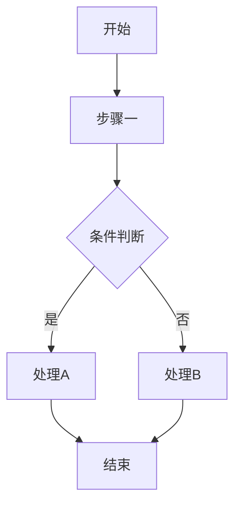

#### 带 subgraph 模板

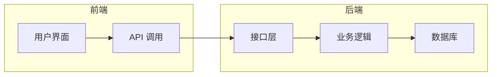

#### 支持的方向

| 声明 | 方向 |
|------|------|
| `flowchart TD` / `flowchart TB` | 上到下 |
| `flowchart BT` | 下到上 |
| `flowchart LR` | 左到右 |
| `flowchart RL` | 右到左 |

#### 支持的节点形状

| 语法 | 形状 |
|------|------|
| `A[文本]` | 矩形 |
| `A(文本)` | 圆角矩形 |
| `A([文本])` | 体育场形 |
| `A[[文本]]` | 子程序 |
| `A[(文本)]` | 数据库 |
| `A((文本))` | 圆形 |
| `A>文本]` | 旗帜形 |
| `A{文本}` | 菱形 ⚠️ 仅用于条件判断节点，不要在普通标签中使用 |
| `A{{文本}}` | 六边形 ⚠️ 同上 |

#### 飞书特有限制

- subgraph 嵌套不宜超过 2 层
- 节点标签中 **不要出现花括号**（除非是菱形条件节点）
- 标签含冒号时用双引号包裹：`A["类型: string"]`

#### 常见错误与修复

```mermaid
<!-- ❌ 错误：标签中有花括号 -->
flowchart TD
    A["{name: value}"] --> B[处理]

<!-- ✅ 修复：移除花括号 -->
flowchart TD
    A["name = value"] --> B[处理]
```

```mermaid
<!-- ❌ 错误：方括号中有冒号 -->
flowchart TD
    A[类型:string] --> B[处理]

<!-- ✅ 修复：加双引号 -->
flowchart TD
    A["类型: string"] --> B[处理]
```

---

### 2.2 sequenceDiagram（时序图）

**diagram_type**: 2 (sequence)

> ⚠️ 复杂度限制最严格的图表类型，必须严格控制规模。

#### 正确模板（简单）

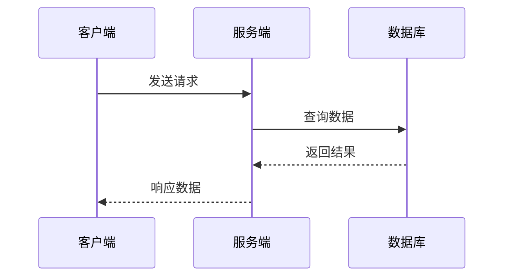

#### 正确模板（带条件）

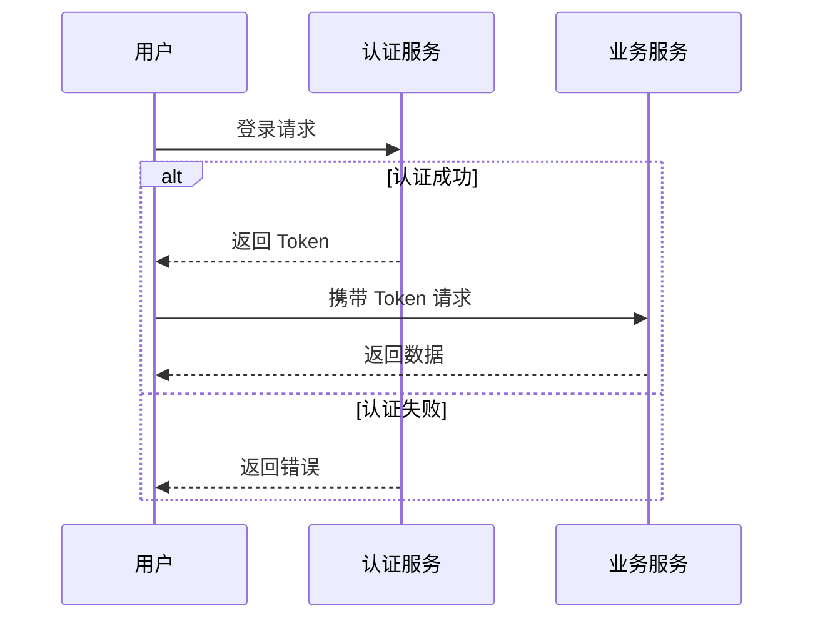

#### 支持的箭头类型

| 语法 | 含义 |
|------|------|
| `->>` | 实线带箭头（同步调用） |
| `-->>` | 虚线带箭头（返回/异步） |
| `->` | 实线无箭头 |
| `-->` | 虚线无箭头 |
| `-x` | 实线带 X（失败） |
| `--x` | 虚线带 X |

#### 支持的控制结构

| 结构 | 语法 | 飞书支持 |
|------|------|---------|
| 条件 | `alt...else...end` | ✅ 限 1 层 |
| 可选 | `opt...end` | ✅ |
| 循环 | `loop...end` | ✅ |
| 并行 | `par...and...end` | ❌ **完全不支持** |
| 临界区 | `critical...end` | ⚠️ 可能不支持 |

#### 复杂度安全阈值（实测数据）

通过二分法实测确定的飞书画板渲染限制：

| 维度 | 安全值 | 警告值 | 必定失败 |
|------|--------|--------|---------|
| participant 数量 | ≤ 6 | 7-9 | ≥ 10（与其他因素叠加） |
| alt 嵌套层数 | 0-1 | — | ≥ 2（与其他因素叠加） |
| 消息标签长度 | ≤ 20 字符 | 21-30 字符 | ≥ 30（与其他因素叠加） |
| 总消息数 | ≤ 20 | 21-30 | ≥ 30（与其他因素叠加） |

**关键发现**：单一维度超限不一定失败，**多维度同时超限** 时必定失败。

| 组合 | 结果 |
|------|------|
| 6 participant + 0 alt + 短标签 | ✅ 安全 |
| 8 participant + 1 alt + 短标签 | ✅ 通常安全 |
| 10 participant + 0 alt + 短标签 | ⚠️ 可能失败 |
| 10 participant + 2 alt + 长标签 | ❌ 必定失败 |
| 6 participant + 2 alt + 30+ 长标签 | ⚠️ 可能失败 |

#### 飞书特有限制

1. **禁止 `par` 语法**：改用 `Note over A,B: 并行处理` 标注
2. **Note 跨度**：`Note over X,Y` 中 X 和 Y 必须相邻，最多跨 2 个
3. **activate/deactivate**：支持，但大量激活可能增加复杂度
4. **participant 别名**：推荐使用（`participant A as 短名`）减少标签宽度

#### 常见错误与修复

```mermaid
<!-- ❌ 错误：使用 par 语法 -->
sequenceDiagram
    par 并行处理
        A->>B: 请求1
    and
        A->>C: 请求2
    end

<!-- ✅ 修复：改用 Note -->
sequenceDiagram
    Note over A,C: 并行处理
    A->>B: 请求1
    A->>C: 请求2
```

```mermaid
<!-- ❌ 错误：太多参与者 + 多层 alt -->
sequenceDiagram
    participant A
    participant B
    participant C
    participant D
    participant E
    participant F
    participant G
    participant H
    participant I
    participant J
    A->>B: 这是一条很长很长的消息标签文字
    alt 条件1
        alt 条件2
            B->>C: 嵌套条件
        end
    end

<!-- ✅ 修复：拆分为两个图 -->
```

#### 拆分建议

当时序图超过安全阈值时：
1. **按阶段拆分**：登录阶段、业务阶段、清理阶段
2. **按模块拆分**：前端交互、后端处理、数据存储
3. **提取公共流程**：认证流程单独一图，主流程引用

---

### 2.3 classDiagram（类图）

**diagram_type**: 4 (class)

#### 正确模板

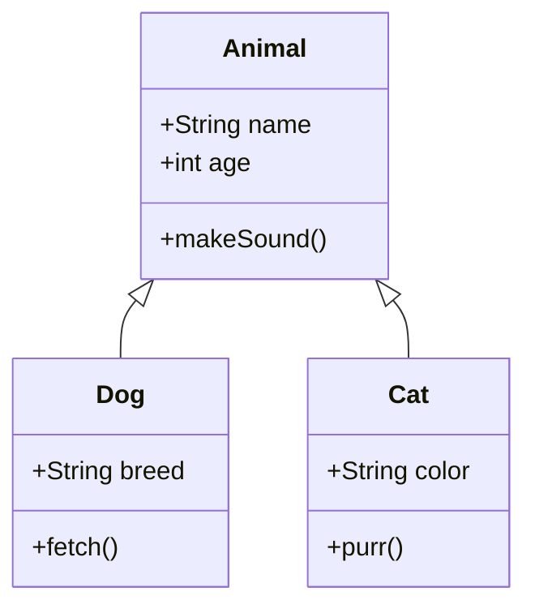

#### 支持的关系

| 语法 | 含义 |
|------|------|
| `<\|--` | 继承 |
| `*--` | 组合 |
| `o--` | 聚合 |
| `-->` | 依赖 |
| `--` | 关联 |
| `..\|>` | 实现 |
| `..>` | 虚线依赖 |

#### 飞书特有限制

- 类数量建议 ≤ 15，超过考虑拆分
- 方法和属性总数不宜过多
- 关系线条交叉过多可能渲染不清晰

---

### 2.4 stateDiagram-v2（状态图）

**diagram_type**: 0 (auto)

> 必须使用 `stateDiagram-v2`，不要使用旧版 `stateDiagram`。

#### 正确模板

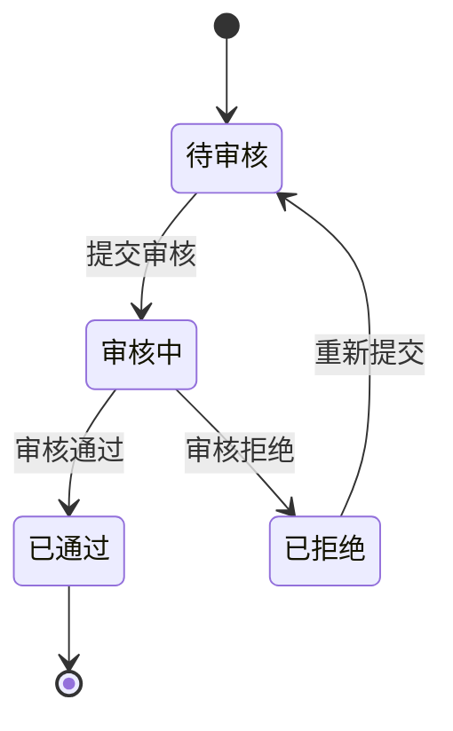

#### 带嵌套状态

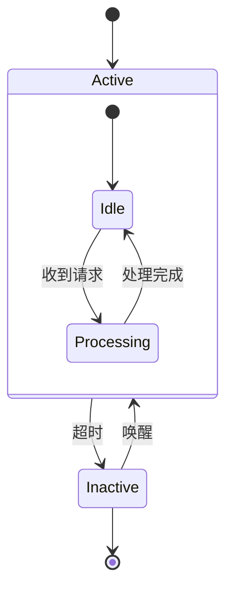

#### 飞书特有限制

- 嵌套状态不宜超过 2 层
- 中文状态名支持良好
- 并发状态（`--`）谨慎使用

---

### 2.5 erDiagram（ER 图）

**diagram_type**: 5 (er)

#### 正确模板

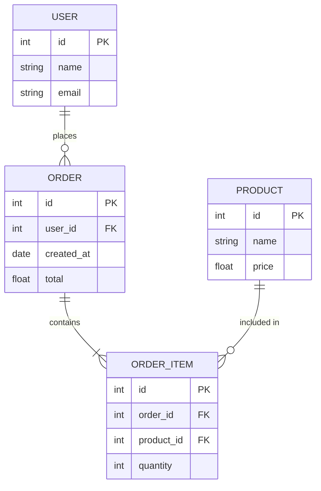

#### 支持的关系符号

| 语法 | 含义 |
|------|------|
| `\|\|--\|\|` | 一对一 |
| `\|\|--o{` | 一对多 |
| `}o--o{` | 多对多 |
| `\|\|--\|{` | 一对多（至少一个） |

#### 飞书特有限制

- 实体数量建议 ≤ 12
- 属性列表不宜过长（每实体 ≤ 10 个属性）
- 关系标签用双引号包裹多词标签

---

### 2.6 gantt（甘特图）

**diagram_type**: 0 (auto)

#### 正确模板

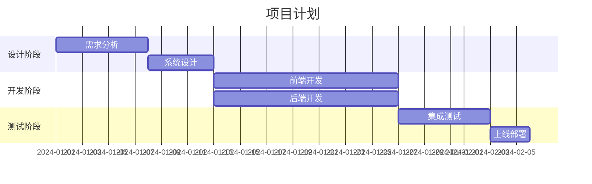

#### 飞书特有限制

- 任务数量建议 ≤ 20
- `dateFormat` 推荐使用 `YYYY-MM-DD`
- 支持 `after` 依赖关系
- section 不宜过多

---

### 2.7 pie（饼图）

**diagram_type**: 0 (auto)

#### 正确模板

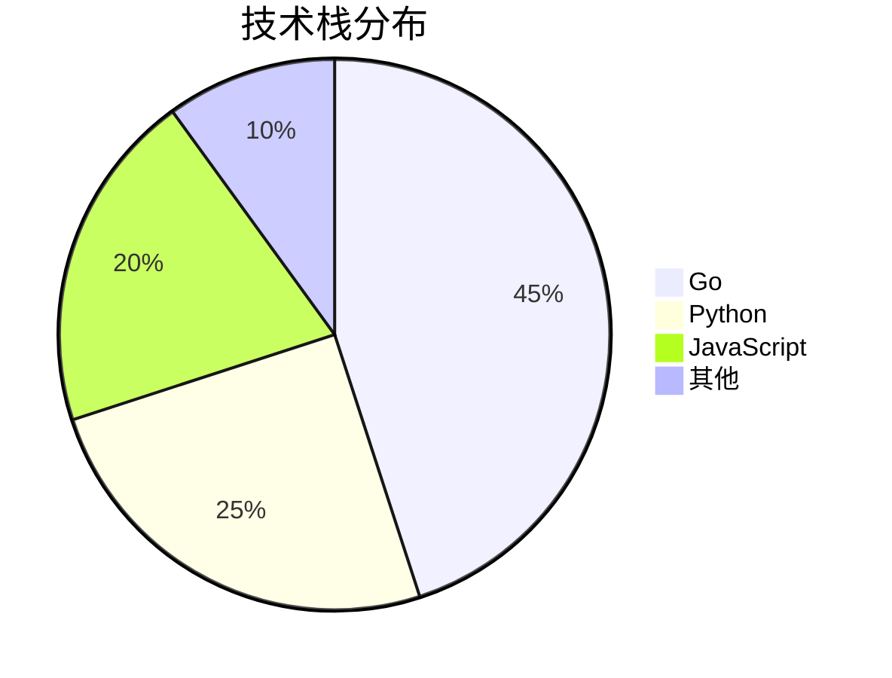

#### 飞书特有限制

- 分片数量建议 ≤ 8
- 标签用双引号包裹
- 数值为正数
- title 是可选的

---

### 2.8 mindmap（思维导图）

**diagram_type**: 1 (mindmap)

#### 正确模板

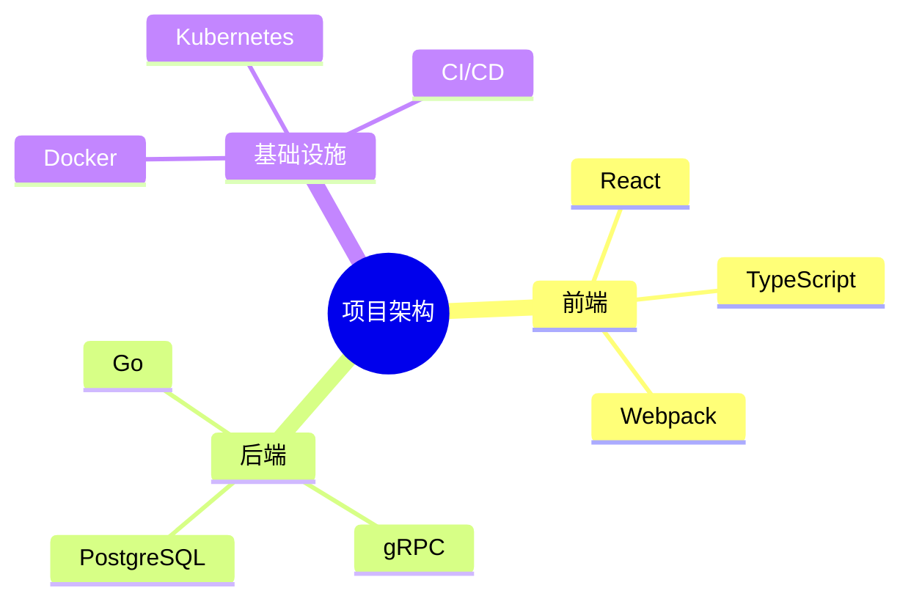

#### 飞书特有限制

- 根节点使用 `root((文字))` 或直接 `root(文字)`
- 缩进表示层级关系（使用空格）
- 层级深度建议 ≤ 4
- 每层节点数建议 ≤ 8
- 不支持节点间连线

---

## 3. 复杂场景处理

### 3.1 大型图表拆分策略

当图表规模超过安全阈值时，应拆分为多个小图：

| 图表类型 | 拆分维度 | 示例 |
|---------|---------|------|
| 流程图 | 按阶段/模块 | 总流程 + 各子流程 |
| 时序图 | 按阶段/参与者组 | 认证流程 + 业务流程 |
| 类图 | 按包/模块 | 模型层 + 服务层 |
| ER 图 | 按领域 | 用户域 + 订单域 |

### 3.2 图表标题与说明

每个图表建议在代码块前添加说明：

~~~~markdown
#### 用户认证流程

以下时序图展示了用户从登录到获取 Token 的完整流程：

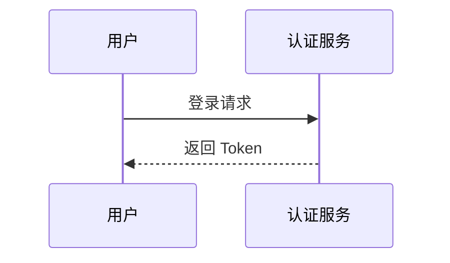
~~~~

### 3.3 失败降级预期

即使严格遵守规范，仍有约 **7% 的失败率**（基于 88 个图表的实测数据）。失败时 feishu-cli 会：

1. 自动重试（最多 10 次，每次间隔 1 秒）
2. 重试无效时降级为代码块（保留原始 Mermaid 代码）
3. 在导入报告中标注失败图表

**降级对文档影响**：代码块中的 Mermaid 代码仍然可读，用户可在飞书中手动处理。

---

## 4. 视觉样式规范（flowchart/graph 必须遵循）

> 生成 flowchart/graph 图表时，**必须**使用 `classDef` 为不同实体类型定义颜色，并使用不同节点形状区分实体类别。禁止所有节点使用相同的默认样式。

### classDef 颜色定义（复制到每个 flowchart 图表末尾）

```
classDef db fill:#e8f5e9,stroke:#2e7d32,color:#1b5e20
classDef es fill:#fff3e0,stroke:#e65100,color:#bf360c
classDef mq fill:#f3e5f5,stroke:#6a1b9a,color:#4a148c
classDef dw fill:#fce4ec,stroke:#c62828,color:#b71c1c
classDef svc fill:#e3f2fd,stroke:#1565c0,color:#0d47a1
classDef faas fill:#e0f7fa,stroke:#00838f,color:#006064
classDef cfg fill:#fffde7,stroke:#f9a825,color:#f57f17
classDef fe fill:#f5f5f5,stroke:#616161,color:#212121
classDef legacy fill:#ffebee,stroke:#c62828,stroke-dasharray:5 5
classDef ext fill:#eceff1,stroke:#455a64,color:#263238
```

### 实体类型 → 颜色 + 形状 对照表

| 实体类型 | classDef | 节点形状 | 适用对象 |
|---------|----------|---------|---------|
| 数据库 MySQL/RDS | `db` | `[(文本)]` 圆柱体 | MySQL, RDS, PostgreSQL |
| 搜索引擎 ES | `es` | `[(文本)]` 圆柱体 | Elasticsearch, ES 索引 |
| 消息队列 MQ | `mq` | `([文本])` 体育场形 | EventBus, Kafka, RocketMQ |
| 数仓 | `dw` | `[(文本)]` 圆柱体 | OneService, Doris, Hive, Dorado |
| RPC 服务 | `svc` | `[文本]` 矩形 | 微服务、RPC 服务端 |
| FaaS 服务 | `faas` | `[文本]` 矩形 | ByteFaaS, DSync FaaS |
| 配置中心 | `cfg` | `[文本]` 矩形 | TCC, Kani, 配置平台 |
| 前端/用户 | `fe` | `(文本)` 圆角矩形 | 前端、用户界面、TLB |
| 旧系统 | `legacy` | `[文本]` 矩形虚线 | 待下线系统、遗留服务 |
| 外部服务 | `ext` | `[文本]` 矩形 | 第三方服务、非团队维护的服务 |

### 注意事项

- **sequenceDiagram 不支持 classDef**，仅 flowchart/graph 类型图表可用
- 每个图表都应通过颜色自解释实体类型
- 新旧系统并存时，旧系统使用 `legacy`（红色虚线边框）明确标识
- 完整规范和使用示例见 `~/.claude/rules/markdown-style-guide.md`

---

## 5. 快速参考卡片

### 视觉样式速查

```
DB=绿色圆柱体 | ES=橙色圆柱体 | MQ=紫色体育场形
RPC=蓝色矩形 | FaaS=青色矩形 | 配置=黄色矩形
前端=灰色圆角 | 旧系统=红色虚线 | 外部=灰蓝色矩形
```

### 图表类型选择

```
需要流程/步骤？     → flowchart
需要交互/调用链？   → sequenceDiagram（≤6 participant）
需要类/结构关系？   → classDiagram
需要状态转换？      → stateDiagram-v2
需要数据库表关系？  → erDiagram
需要项目排期？      → gantt
需要占比分布？      → pie
需要层级梳理？      → mindmap
```

### 安全检查速记

```
✅ 8 种图表类型
❌ 花括号 {} 在标签中
❌ par...and...end
❌ Note over 跨 3+ participant
❌ sequenceDiagram: 10+ participant + 2+ alt
⚠️ 方括号冒号 → 加双引号
⚠️ 复杂嵌套 → 考虑拆分
```
