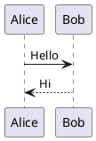

# 飞书 Markdown 兼容指南

生成将导入飞书的 Markdown 前，按本指南检查。执行导入见 `../workflow.md`，编辑已有文档见 `../../write/workflow.md`。
标注"实测"的结论来自 2026-10 用 feishu-cli v1.42.0 在测试文档上的 `doc import` 回归；服务端渲染能力可能继续变化，
导入后以命令输出的 `diagram_fallback` / `failures` 为准。

## 快速检查

| 内容 | 必检项 |
|---|---|
| Mermaid | 用受支持的图类型（见下表）；`journey`、`gitGraph` 不支持；超大图拆分 |
| PlantUML | 必须有 `@startuml` / `@enduml` |
| SVG | 恰好三个反引号的 `svg` fence；整段作为一个 svg 节点写入画板 |
| 表格 | 行 > 9 可导入同一 block；列 > 9 会拆列组；超大表建议 Sheet |
| 图片 | `doc import` 默认上传（相对路径按 Markdown 文件所在目录）；`doc add` 需 `--upload-images`；`content-update` 自动上传本地图片/附件 |
| 公式 | 行内 `$...$`（正文与表格单元格均转为公式）；块级 `$$...$$` 导入为只含公式的文本块（飞书无独立块级公式块） |
| Callout | 仅 NOTE/WARNING/TIP/CAUTION/IMPORTANT/SUCCESS（另接受 INFO，按 NOTE 处理） |
| 引用 | 单层引用内可放段落和列表；嵌套引用 `> >` 会被扁平化进外层引用（飞书不支持引用嵌套，内容不丢但层级消失） |
| 列表 | 列表项的第二段起要缩进到列表正文列并与首段空一行，才会作为该项的子段落保留 |
| HTML 扩展标签 | 块级标签开标签独占一行；带 token 的 `<image>/<file>/<whiteboard>` 复用原素材/复制画板，带 token 的 `<sheet>/<bitable>` 降级为链接（见下文） |

## Mermaid

`doc import` 对所有 Mermaid 代码块使用自动识别（`diagram_type=auto`）。服务端当前可渲染的类型（实测，与服务端报错信息
列出的支持集合一致）：

| 类型 | 声明 |
|---|---|
| 流程图 | `flowchart TD` / `flowchart LR` / `graph TD` |
| 时序图 | `sequenceDiagram` |
| 类图 | `classDiagram` |
| 状态图 | `stateDiagram-v2`（旧版 `stateDiagram` 也可） |
| ER 图 | `erDiagram` |
| 甘特图 | `gantt` |
| 饼图 | `pie` |
| 思维导图 | `mindmap` |
| 时间线 | `timeline` |
| 象限图 | `quadrantChart`（轴标签用英文：`x-axis 低 --> 高` 这类中文轴标签实测词法报错） |
| XY 图 | `xychart-beta` |

不支持的类型（如 `journey`、`gitGraph`）和语法错误都会直接降级为代码块（不重试，命令退出码仍为 0，`diagram_fallback` 计数）。

编写建议：

1. 以前文档里的硬性禁令已不再成立（实测均能正常渲染）：普通标签含花括号 `A["{name: value}"]`、方括号内冒号 `A[类型:string]`、
   `par...and...end`、`Note over` 跨 3 个参与者、10 participant + 2 层 alt + 30 余条长消息的时序图。仍建议
   条件节点用 `A{判断}`、复杂图按阶段拆分——这是为了可读性，不是渲染限制。
2. 需要指定图类型（如强制 `class` / `state` 布局）时不走 `doc import`，用 feishu-cli-visual 的
   `board import <whiteboard_id> <file> --syntax mermaid --diagram-type <type>`。

更多模板与样式规范见 `mermaid-spec.md`。

## PlantUML

仅在 Mermaid 不覆盖的图类型使用 PlantUML。



- 必须有 `@startuml` / `@enduml`；缺失时服务端报语法错误并降级为代码块（实测）。
- 行首缩进、`skinparam`、类图成员可见性标记（`+name` / `-login()`）实测均可渲染，不必刻意去掉；图过于复杂时同样建议拆分。

## 表格

普通 Markdown 表格可以导入 docx：

- 行数 > 9：CLI 用 `insert_table_row` 追加到同一个 table block。
- 列数 > 9：按列组拆分（每组 ≤ 9 列），保留首列用于识别行。
- **单元格内可放图片**（`|  |`）：`doc import` 会在表格填充后真正嵌入为单元格内图片，不丢失也不退化为文字；
  纯图片单元格不会多出 alt 说明文字。`doc add` 的单元格图片降级为 `[图片: 说明]` 文本占位。`content-update` 由服务端解析表格，
  单元格内的本地图片同样经占位协议自动上传。
- 数据表、长表和需要排序筛选的内容优先生成 Sheet：`feishu-cli sheet import-md`。
- **自定义列宽**：默认按内容启发式（中文 14px / 英文 8px / 最小 80 / 最大 400）。需要精控时两种方式可覆盖：
  - 紧邻表格上方注释（**注释必须独占一行**，中间夹任何 heading/段落/列表/代码块/link-ref-def 都会丢弃注释）：
    ```markdown
    <!-- feishu-colwidth: 80,200,*,30% -->
    | 列1 | 列2 | 列3 | 列4 |
    |-----|-----|-----|-----|
    ```
    单位：`px` 整数、`30%` 百分比（按 700px 文档宽度换算）、`*` 或空（该列走 auto）
  - CLI flag 全局覆盖：`feishu-cli doc import doc.md --table-column-width=80,200,*,120`
  - 优先级：注释 > flag explicit > flag fixed > auto；最终都过 `[80, 400]` 像素 clamp
  - 列宽数量与表实际列数不一致时 stderr 打印警告（多写截断、少写补 auto）
  - **适用范围**：`doc import` 与 `doc add`。`doc content-update` 不支持自定义列宽，传非 `auto` 的 flag 或内容中含该注释都会以退出码 2 拒绝，需要控制列宽时改用 `doc import`。

## Callout

```markdown
> [!NOTE]
> 普通提示

> [!WARNING]
> 风险提示
```

支持：`NOTE`（浅蓝）、`WARNING`（浅红）、`TIP`（浅黄）、`CAUTION`（浅橙）、`IMPORTANT`（浅紫）、`SUCCESS`（浅绿）；`INFO` 与未知类型按 NOTE 处理。
Callout 内可包含段落和列表。

## 图片与文件

```markdown


```

各写命令的图片能力以 [写入工作流](../../write/workflow.md#markdown-图片) 为准：`doc import` 默认上传；`doc add` 要显式传 `--upload-images`；`content-update` 自动上传本地图片/附件（无需该 flag）。单独插入图片或附件用 `feishu-cli doc media-insert`。

表格单元格里的图片由 `doc import` 真正嵌入为单元格内图片；与文字混排的行内图片统一降级为 `[图片: 说明]`（http(s) 为可点击链接，本地路径为纯文本，不泄漏原始路径）。

## 扩展标签

导出端生成的扩展标签在 `doc import` 中的可用性（实测）：

```html
<mention-user id="ou_xxx"/>
<mention-doc token="doc_token_xxx" type="docx">标题</mention-doc>
<callout type="NOTE">
内容
</callout>
<sheet rows="5" cols="5"/>
```

- 块级标签（`<callout>` 等）开标签独占一行、内容另起一行；写在同一行只会得到普通文字。
- `<grid cols>` + `<column>` 分栏：列内可含多段落、列表、表格、图片（列内空行不影响解析）；列数取 `<column>` 实际数量，范围 2-5。
- 带 token 的 `<image>` / `<file>` / `<video src="feishu://media/…">` 导入时下载原素材重新上传；`<whiteboard token>` 复制源画板。
  当前身份读不到源素材时降级为占位文本并计入 `failures`（退出码 1），其余内容照常导入。
- 带 token 的 `<sheet>` / `<bitable>` 无法挂进新文档，降级为指向原表格的链接并计入 `failures`。
- 手写时只使用自己确实需要的标签；普通内容优先标准 Markdown。完整标签表见 `../workflow.md`。

## 导入前验证

1. 文件必须是 UTF-8，且不包含 U+FFFD 替换字符。
2. Mermaid/PlantUML 按上方规则扫一遍（类型受支持、PlantUML 有 `@startuml`）。
3. 图片路径要能从 Markdown 文件所在目录解析（绝对路径最稳妥）。
4. 超大表格改 Sheet，避免文档导入耗时过长。
