# Mermaid 飞书画板语法规范

本文档给出飞书画板 Mermaid 渲染的常用模板、实测渲染能力、可读性建议与 flowchart 视觉样式规范。
标注"实测"的结论来自 2026-10 用 feishu-cli v2.0.0 `doc import` 在测试文档上的回归；服务端能力可能继续变化，
以导入输出的 `diagram_fallback` / `failures` 为准。

---

## 目录

- [通用规则](#1-通用规则)
- [图表类型详解](#2-图表类型详解)
- [复杂场景处理](#3-复杂场景处理)
- [视觉样式规范](#4-视觉样式规范flowchartgraph-必须遵循)
- [快速参考卡片](#5-快速参考卡片)

## 1. 通用规则

### 支持的图表类型（实测）

服务端当前可渲染：flowchart / graph、sequenceDiagram、classDiagram、stateDiagram / stateDiagram-v2、erDiagram、gantt、pie、
mindmap、timeline、quadrantChart、xychart-beta。`journey`、`gitGraph` 等其他类型会被服务端拒绝（`code=2890002 ... not supported`），
与语法错误一样**不重试、直接降级为代码块**。

### 已放宽的历史限制（实测可正常渲染）

| 旧规则 | 当前实测 |
|------|------|
| 普通标签禁止字面花括号 | `A["{name: value}"]` 正常显示花括号文本；`A{判断}` / `A{{判断}}` 仍是条件 / 六边形形状 |
| 方括号内冒号必须加引号 | `A[类型:string]` 正常渲染；加双引号 `A["类型: string"]` 仍是更稳妥的写法 |
| 禁止 `par...and...end` | 渲染为组合片段（combined fragment），`critical` / `break` / `rect` 同样可用 |
| `Note over` 最多跨 2 个参与者 | 跨 3 个参与者正常渲染 |
| 10+ participant + 2 层 alt + 30+ 长标签必定失败 | 10 participant + 2 层嵌套 alt + 32 条长消息正常渲染 |

这些写法不再是导入失败的原因；但图越复杂越难阅读，仍建议按 [3.1](#31-大型图表拆分策略) 拆分。

### 图表类型参数

`doc import` 对所有 Mermaid 代码块使用 `diagram_type=auto`，下文各类型标注的 `--diagram-type` 只在用 feishu-cli-visual 的
`board import <whiteboard_id> <file> --syntax mermaid --diagram-type <type>` 单独导入时使用（可选值
`auto/mindmap/sequence/activity/class/er/flowchart/state/component`）。

---

## 2. 图表类型详解

### 2.1 flowchart（流程图）

`--diagram-type flowchart`

#### 正确模板

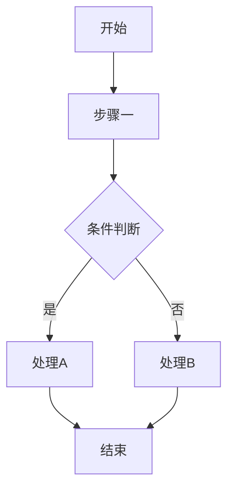

#### 带 subgraph 模板

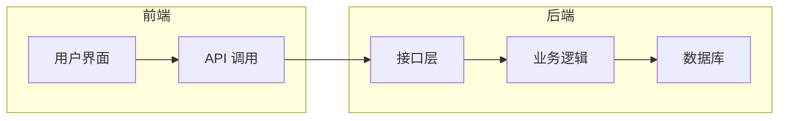

#### 支持的方向

| 声明 | 方向 |
|------|------|
| `flowchart TD` / `flowchart TB` | 上到下 |
| `flowchart BT` | 下到上 |
| `flowchart LR` | 左到右 |
| `flowchart RL` | 右到左 |

#### 支持的节点形状

| 语法 | 形状 |
|------|------|
| `A[文本]` | 矩形 |
| `A(文本)` | 圆角矩形 |
| `A([文本])` | 体育场形 |
| `A[[文本]]` | 子程序 |
| `A[(文本)]` | 数据库 |
| `A((文本))` | 圆形 |
| `A>文本]` | 旗帜形 |
| `A{文本}` | 菱形（条件判断节点） |
| `A{{文本}}` | 六边形 |

#### 编写建议

- subgraph 嵌套 3 层实测可渲染，但层级越深越难阅读，建议 ≤ 2 层
- 标签含冒号、括号等特殊字符时用双引号包裹：`A["类型: string"]`（不加引号实测也能渲染，加引号更稳妥）

---

### 2.2 sequenceDiagram（时序图）

`--diagram-type sequence`

> 时序图最容易因规模过大而难以阅读；渲染本身实测可承受 10 participant + 2 层 alt + 30 余条长消息。

#### 正确模板（简单）

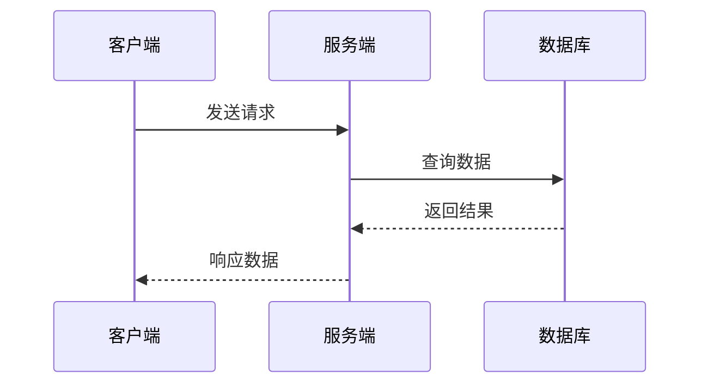

#### 正确模板（带条件）

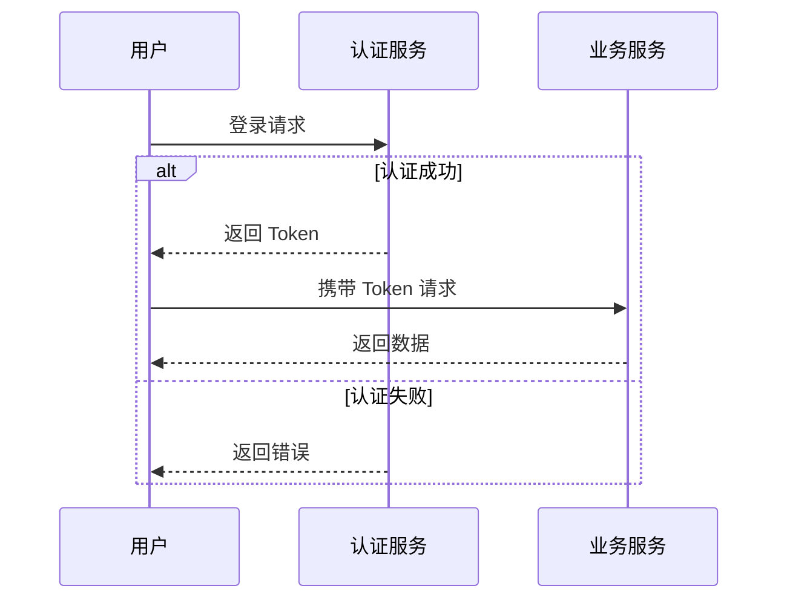

#### 支持的箭头类型

| 语法 | 含义 |
|------|------|
| `->>` | 实线带箭头（同步调用） |
| `-->>` | 虚线带箭头（返回/异步） |
| `->` | 实线无箭头 |
| `-->` | 虚线无箭头 |
| `-x` | 实线带 X（失败） |
| `--x` | 虚线带 X |

#### 支持的控制结构

| 结构 | 语法 | 飞书支持 |
|------|------|---------|
| 条件 | `alt...else...end` | ✅ 限 1 层 |
| 可选 | `opt...end` | ✅ |
| 循环 | `loop...end` | ✅ |
| 并行 | `par...and...end` | ✅ 实测渲染为组合片段 |
| 临界区 / 中断 | `critical...option...end`、`break...end` | ✅ 实测 |
| 背景高亮 | `rect rgb(...)...end` | ✅ 实测 |

#### 可读性建议

- participant 建议 ≤ 8，`alt` 嵌套 ≤ 1 层，消息标签简短——超出时渲染实测仍成功，但画板会很难阅读
- `activate/deactivate`、`Note over A,C` 跨多个参与者均可使用
- 用 participant 别名（`participant A as 短名`）减少标签宽度

#### 拆分建议

当时序图超过安全阈值时：
1. **按阶段拆分**：登录阶段、业务阶段、清理阶段
2. **按模块拆分**：前端交互、后端处理、数据存储
3. **提取公共流程**：认证流程单独一图，主流程引用

---

### 2.3 classDiagram（类图）

`--diagram-type class`

#### 正确模板

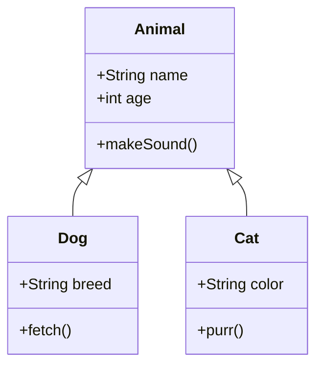

#### 支持的关系

| 语法 | 含义 |
|------|------|
| `<\|--` | 继承 |
| `*--` | 组合 |
| `o--` | 聚合 |
| `-->` | 依赖 |
| `--` | 关联 |
| `..\|>` | 实现 |
| `..>` | 虚线依赖 |

#### 编写建议

- 类数量建议 ≤ 15，超过考虑拆分
- 方法和属性总数不宜过多
- 关系线条交叉过多可能渲染不清晰

---

### 2.4 stateDiagram-v2（状态图）

`--diagram-type state`

> 推荐 `stateDiagram-v2`；旧版 `stateDiagram` 实测也能渲染。

#### 正确模板

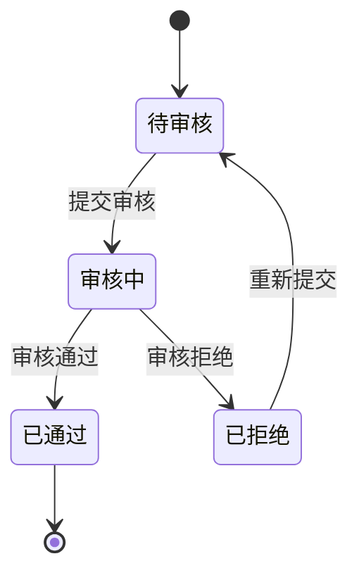

#### 带嵌套状态

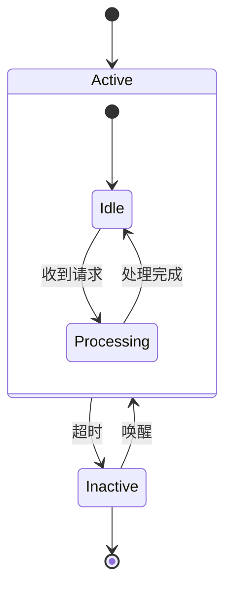

#### 编写建议

- 嵌套状态不宜超过 2 层
- 中文状态名支持良好
- 并发状态（`--`）谨慎使用

---

### 2.5 erDiagram（ER 图）

`--diagram-type er`

#### 正确模板

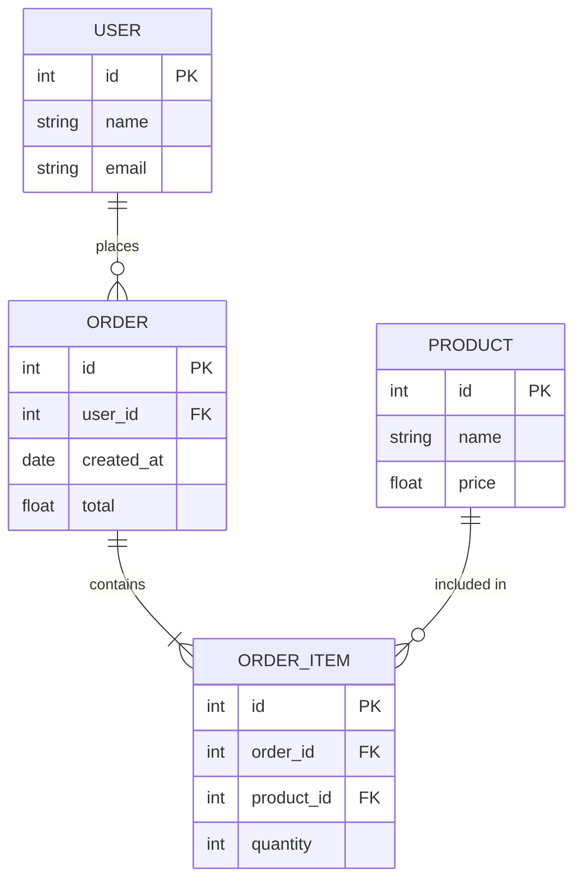

#### 支持的关系符号

| 语法 | 含义 |
|------|------|
| `\|\|--\|\|` | 一对一 |
| `\|\|--o{` | 一对多 |
| `}o--o{` | 多对多 |
| `\|\|--\|{` | 一对多（至少一个） |

#### 编写建议

- 实体数量建议 ≤ 12
- 属性列表不宜过长（每实体 ≤ 10 个属性）
- 关系标签用双引号包裹多词标签

---

### 2.6 gantt（甘特图）

`--diagram-type auto`

#### 正确模板

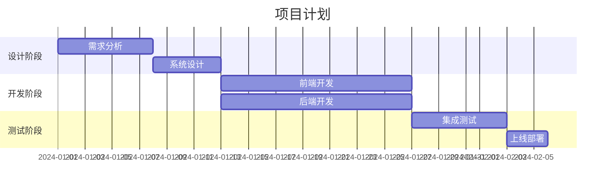

#### 编写建议

- 任务数量建议 ≤ 20
- `dateFormat` 推荐使用 `YYYY-MM-DD`
- 支持 `after` 依赖关系
- section 不宜过多

---

### 2.7 pie（饼图）

`--diagram-type auto`

#### 正确模板

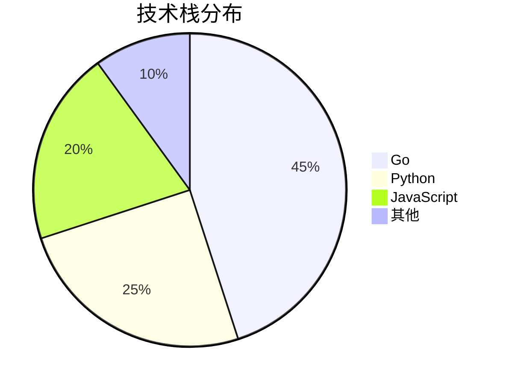

#### 编写建议

- 分片数量建议 ≤ 8
- 标签用双引号包裹
- 数值为正数
- title 是可选的

---

### 2.8 mindmap（思维导图）

`--diagram-type mindmap`

#### 正确模板

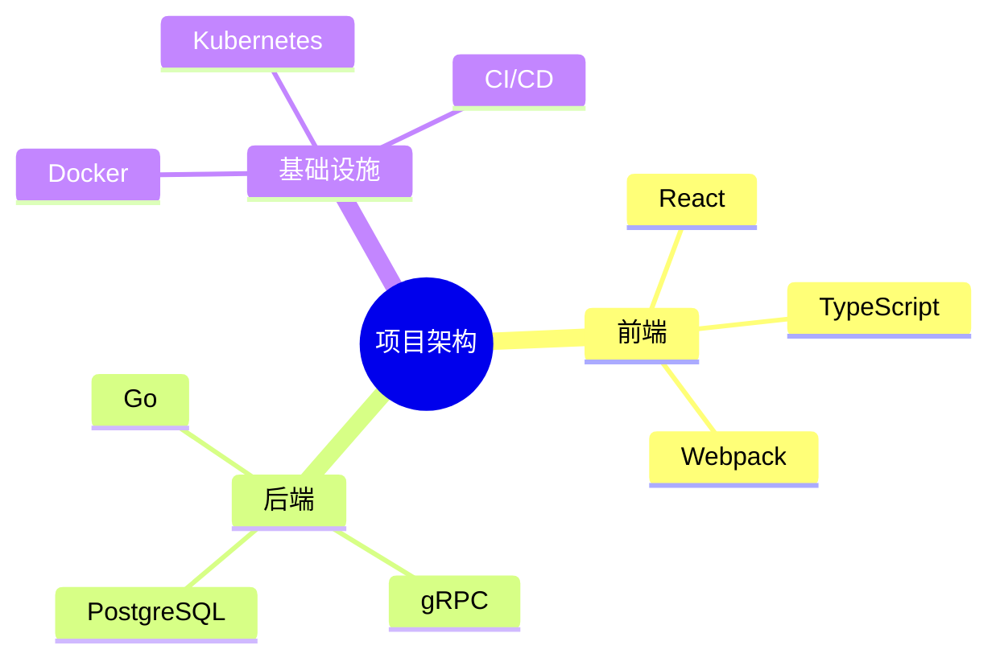

#### 编写建议

- 根节点使用 `root((文字))` 或直接 `root(文字)`
- 缩进表示层级关系（使用空格）
- 层级深度建议 ≤ 4
- 每层节点数建议 ≤ 8
- 不支持节点间连线

---

## 3. 复杂场景处理

### 3.1 大型图表拆分策略

当图表规模超过安全阈值时，应拆分为多个小图：

| 图表类型 | 拆分维度 | 示例 |
|---------|---------|------|
| 流程图 | 按阶段/模块 | 总流程 + 各子流程 |
| 时序图 | 按阶段/参与者组 | 认证流程 + 业务流程 |
| 类图 | 按包/模块 | 模型层 + 服务层 |
| ER 图 | 按领域 | 用户域 + 订单域 |

### 3.2 图表标题与说明

每个图表建议在代码块前添加说明：

~~~~markdown
#### 用户认证流程

以下时序图展示了用户从登录到获取 Token 的完整流程：

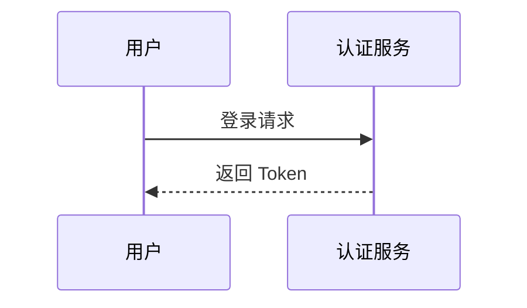
~~~~

### 3.3 失败降级预期

图表导入失败时 feishu-cli 会：

1. 服务端错误（5xx）与限流按指数退避自动重试（`--diagram-retries`，默认 10 次）；语法错误、不支持的图类型等 4xx 错误不重试
2. 删除空画板并在原位置降级为代码块（保留原始 Mermaid 代码），stderr 打印 `✗` 明细，统计计入 `diagram_fallback`
3. 降级成功不算失败，命令退出码仍为 0；降级也失败时才计入 `failures` 并以退出码 1 结束

**降级对文档影响**：代码块中的 Mermaid 代码仍然可读，用户可在飞书中手动处理。

---

## 4. 视觉样式规范（flowchart/graph 必须遵循）

> 生成 flowchart/graph 图表时，**必须**使用 `classDef` 为不同实体类型定义颜色，并使用不同节点形状区分实体类别。禁止所有节点使用相同的默认样式。

### classDef 颜色定义（复制到每个 flowchart 图表末尾）

色值取自 `feishu-cli-visual` 统一色板，与 board/htmlbox/card 管线同一套色相家族：
前 8 类（db…legacy 的彩色部分）用"浅底/深边派生对"（fill 淡底、stroke/文字深边，
这 8 对的深边对白底对比度 ≥ 7:1）；fe/ext 两类中性角色用色板的中性阶
（fe = 灰淡底 + secondary ink 边，ext = 白底 + muted 灰边，读作"系统外的空心节点"）：

```
classDef db fill:#e0f6dd,stroke:#0c6800,color:#0c6800
classDef es fill:#ffeadf,stroke:#893b00,color:#893b00
classDef mq fill:#efecff,stroke:#611dc5,color:#611dc5
classDef dw fill:#ffe7f1,stroke:#990064,color:#990064
classDef svc fill:#e6efff,stroke:#1446c2,color:#1446c2
classDef faas fill:#d3f8ef,stroke:#006456,color:#006456
classDef cfg fill:#fdecd1,stroke:#714e00,color:#714e00
classDef fe fill:#f2f3f5,stroke:#646a73,color:#1f2329
classDef legacy fill:#ffe9e6,stroke:#a30011,stroke-dasharray:5 5
classDef ext fill:#ffffff,stroke:#8f959e,color:#1f2329
```

### 实体类型 → 颜色 + 形状 对照表

| 实体类型 | classDef | 节点形状 | 适用对象 |
|---------|----------|---------|---------|
| 数据库 MySQL/RDS | `db` | `[(文本)]` 圆柱体 | MySQL, RDS, PostgreSQL |
| 搜索引擎 ES | `es` | `[(文本)]` 圆柱体 | Elasticsearch, ES 索引 |
| 消息队列 MQ | `mq` | `([文本])` 体育场形 | EventBus, Kafka, RocketMQ |
| 数仓 | `dw` | `[(文本)]` 圆柱体 | OneService, Doris, Hive, Dorado |
| RPC 服务 | `svc` | `[文本]` 矩形 | 微服务、RPC 服务端 |
| FaaS 服务 | `faas` | `[文本]` 矩形 | ByteFaaS, DSync FaaS |
| 配置中心 | `cfg` | `[文本]` 矩形 | TCC, Kani, 配置平台 |
| 前端/用户 | `fe` | `(文本)` 圆角矩形 | 前端、用户界面、TLB |
| 旧系统 | `legacy` | `[文本]` 矩形虚线 | 待下线系统、遗留服务 |
| 外部服务 | `ext` | `[文本]` 矩形 | 第三方服务、非团队维护的服务 |

### 注意事项

- **sequenceDiagram 不支持 classDef**，仅 flowchart/graph 类型图表可用
- 每个图表都应通过颜色自解释实体类型
- 新旧系统并存时，旧系统使用 `legacy`（红色虚线边框）明确标识

---

## 5. 快速参考卡片

### 视觉样式速查

```
DB=绿色圆柱体 | ES=橙色圆柱体 | MQ=紫色体育场形
RPC=蓝色矩形 | FaaS=青色矩形 | 配置=黄色矩形
前端=灰底圆角 | 旧系统=红色虚线 | 外部=白底灰边矩形
```

### 图表类型选择

```
需要流程/步骤？     → flowchart
需要交互/调用链？   → sequenceDiagram（建议 ≤ 8 participant）
需要类/结构关系？   → classDiagram
需要状态转换？      → stateDiagram-v2
需要数据库表关系？  → erDiagram
需要项目排期？      → gantt
需要占比分布？      → pie（≤8 片；相近占比用表格/条形更诚实）
需要层级梳理？      → mindmap
需要时间线/里程碑？ → timeline
```

**数据图表（占比/趋势/对比）先按数据任务选形式**，不按用户口头图表名 —— 判断
启发式与反模式清单见 `feishu-cli-visual` 技能；Mermaid 画不了的形式（柱状对比、
多系列趋势）考虑 htmlbox（要动）或 board SVG（静态）管线。

### 安全检查速记

```
✅ 11 种类型：flowchart/graph、sequence、class、state、er、gantt、pie、mindmap、timeline、quadrantChart、xychart-beta
❌ journey、gitGraph 等其他类型 → 降级为代码块
✅ 花括号标签、par/critical/break、Note 跨多参与者（实测可渲染）
⚠️ 标签含冒号等特殊字符 → 加双引号更稳妥
⚠️ 复杂嵌套、超多参与者 → 为可读性拆分
```
