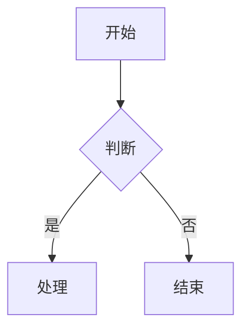
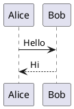

# Markdown 导入技能

从本地 Markdown 文件创建或更新飞书云文档。**支持 Mermaid/PlantUML 图表转飞书画板、大表格自动拆分**。

## 核心特性

1. **三阶段并发管道**：顺序创建块 → 并发处理图表/表格 → 失败回退
2. **Mermaid/PlantUML → 飞书画板**：`mermaid`/`plantuml`/`puml` 代码块自动转换为飞书画板
3. **图表故障容错**：语法错误自动降级为代码块展示，服务端错误自动重试（最多 10 次，1s 间隔）
4. **大表格自动拆分**：超过 9 行的表格自动拆分为多个表格，每个保留表头
5. **表格列宽自动计算**：根据内容智能计算列宽（中英文区分，最小 80px，最大 400px）
6. **API 限流处理**：自动重试，避免 429 错误
7. **并发控制**：图表和表格分别使用独立的 worker 池（默认图表 5、表格 3 并发）

## 核心概念

**Markdown 作为中间态**：本地文档与飞书云文档之间通过 Markdown 格式进行转换。

## 使用方法

```bash
# 创建新文档
/feishu-import ./document.md --title "文档标题"

# 更新已有文档
/feishu-import ./document.md --document-id <existing_doc_id>

# 上传本地图片
/feishu-import ./document.md --title "带图文档" --upload-images
```

## 执行流程

### 创建新文档

1. **验证文件**
   - 检查 Markdown 文件是否存在
   - 预览文件内容

2. **执行导入**
   ```bash
   feishu-cli doc import <file.md> --title "<title>" [--upload-images]
   ```

3. **添加权限**
   ```bash
   feishu-cli perm add <document_id> --doc-type docx --member-type email --member-id user@example.com --perm full_access
   ```

4. **发送通知**
   通知用户文档已创建

### 更新已有文档

1. **执行更新**
   ```bash
   feishu-cli doc import <file.md> --document-id <doc_id> [--upload-images]
   ```

2. **通知用户**

## 参数说明

| 参数 | 说明 | 默认值 |
|------|------|--------|
| markdown_file | Markdown 文件路径 | 必需 |
| --title | 新文档标题 | 文件名 |
| --document-id | 更新已有文档 | 创建新文档 |
| --upload-images | 上传本地图片 | 否 |
| --diagram-workers | 图表 (Mermaid/PlantUML) 并发导入数 | 5 |
| --table-workers | 表格并发填充数 | 3 |
| --diagram-retries | 图表最大重试次数 | 10 |
| --verbose | 显示详细进度信息 | 否 |

## 支持的 Markdown 语法

- 标题（# ~ ######）
- 段落文本
- 无序/有序列表（支持无限深度嵌套、混合嵌套）
- 任务列表（- [ ] / - [x]）
- 代码块（带语言标识）
- **Mermaid/PlantUML 图表** → 自动转换为飞书画板
- **引用块**（支持嵌套引用，自动转换为 QuoteContainer）
- **Callout 高亮块**（`> [!NOTE]`、`> [!WARNING]` 等 6 种类型）
- 分割线
- **表格**（超过 9 行自动拆分）
- 粗体、斜体、删除线、行内代码、**下划线**（`<u>文本</u>`）
- 链接
- **行内公式**（`$E = mc^2$`，支持一段中多个公式）
- **块级公式**（`$$formula$$` 或独立行 `$formula$`）

### 图表示例（推荐使用 Mermaid）

````markdown

````

````markdown

````

支持的 Mermaid 图表类型（全部已验证）：
- ✅ flowchart（流程图，支持 subgraph 嵌套）
- ✅ sequenceDiagram（时序图）
- ✅ classDiagram（类图）
- ✅ stateDiagram-v2（状态图）
- ✅ erDiagram（ER 图）
- ✅ gantt（甘特图）
- ✅ pie（饼图）
- ✅ mindmap（思维导图）

### Callout 高亮块示例

````markdown
> [!NOTE]
> 这是一个提示信息。

> [!WARNING]
> 这是一个警告信息。

> [!TIP]
> 这是一个技巧提示。

> [!CAUTION]
> 这是一个警示。

> [!IMPORTANT]
> 这是一个重要信息。

> [!SUCCESS]
> 这是一个成功信息。
````

Callout 内部支持子块（段落、列表等），自动创建为 Callout 的子块。

背景色映射：

| 类型 | 背景色 |
|------|--------|
| NOTE/INFO | 蓝色 (6) |
| WARNING | 红色 (2) |
| TIP | 黄色 (4) |
| CAUTION | 橙色 (3) |
| IMPORTANT | 紫色 (7) |
| SUCCESS | 绿色 (5) |

### 公式示例

````markdown
行内公式：爱因斯坦质能方程 $E = mc^2$ 是最著名的公式。

块级公式（独立行）：
$\int_{0}^{\infty} e^{-x^2} dx = \frac{\sqrt{\pi}}{2}$
````

- 行内公式支持一段内多个 `$...$` 公式
- 块级公式在飞书中创建为 Text 块内的 Equation 元素
- 公式内容保持 LaTeX 原文

### 下划线示例

```markdown
这段文本包含 <u>下划线</u> 样式。
```

## 输出格式

```
已导入文档！
  文档 ID: <document_id>
  文档链接: https://feishu.cn/docx/<document_id>
  导入块数: 25
```

## 示例

```bash
# 创建新文档
/feishu-import ./meeting-notes.md --title "会议纪要"

# 更新现有文档
/feishu-import ./updated-spec.md --document-id <document_id>

# 带图片导入
/feishu-import ./blog-post.md --title "博客文章" --upload-images
```

## 已验证功能

以下导入功能已通过测试验证：

| Markdown 语法 | 导入状态 | 说明 |
|--------------|---------|------|
| 标题（# ~ ######） | ✅ 正常 | |
| 段落文本 | ✅ 正常 | |
| 无序列表（含嵌套） | ✅ 正常 | 支持无限深度嵌套 |
| 有序列表（含嵌套） | ✅ 正常 | 支持无限深度嵌套 |
| 混合嵌套列表 | ✅ 正常 | 有序/无序混合嵌套 |
| 任务列表 | ✅ 正常 | |
| 代码块 | ✅ 正常 | |
| **Mermaid/PlantUML 图表** | ✅ 正常 | 自动转为飞书画板 |
| **引用块** | ✅ 正常 | 转为 QuoteContainer，支持嵌套引用 |
| **Callout 高亮块** | ✅ 正常 | 6 种类型，支持子块 |
| 分割线 | ✅ 正常 | |
| **粗体**/`*斜体*`/~~删除线~~ | ✅ 正常 | |
| **下划线** (`<u>`) | ✅ 正常 | |
| 行内代码 | ✅ 正常 | |
| **行内公式** (`$...$`) | ✅ 正常 | 支持一段多个公式 |
| **块级公式** (`$$...$$`) | ✅ 正常 | 创建为 Text 块内 Equation 元素 |
| **表格** | ✅ 正常 | 超过9行自动拆分 |
| 链接 | ✅ 正常 | |

### 大规模测试结果

已验证可成功导入的大型文档：
- **10,000+ 行 Markdown** ✓
- **127 个 Mermaid 图表** → 全部成功转换为飞书画板 ✓
- **170+ 个表格**（含大表格拆分、列宽自动计算）→ 全部成功 ✓
- **8 种图表类型** → flowchart/sequenceDiagram/classDiagram/stateDiagram/erDiagram/gantt/pie/mindmap 全部成功 ✓
- **88 个 Mermaid 图表逐个测试** → 82/88 成功，6 个失败（3 个服务端瞬时错误 + 2 个花括号语法 + 1 个提取异常）

### 三阶段并发管道架构

1. **阶段一（顺序）**：创建所有文档块，收集图表（Mermaid/PlantUML）和表格任务
2. **阶段二（并发）**：使用 worker 池并发处理图表导入和表格填充
3. **阶段三（逆序）**：处理失败的图表 → 删除空画板块，插入代码块作为降级展示

### Mermaid 已知限制

| 限制 | 说明 | 处理方式 |
|------|------|----------|
| `{}` 花括号 | Mermaid 解析器将 `{text}` 识别为菱形节点 | 自动降级为代码块 |
| `par...and...end` | 飞书解析器完全不支持 par 并行语法 | 用 `Note over X: 并行执行` 替代 |
| 渲染复杂度组合超限 | 单一因素不会触发，但 10+ participant + 2+ alt 块 + 30+ 长消息标签组合时服务端返回 500 | 重试后降级为代码块 |
| 服务端瞬时错误 | 偶发 HTTP 500（并发压力导致） | 自动重试（最多 10 次，1s 间隔） |
| Parse error 不重试 | 语法错误直接降级 | 自动降级为代码块 |

**渲染复杂度安全阈值**（二分法实测）：
- participant ≤8 或 alt ≤1 或消息标签简短 → 安全
- 10 participant + 2 alt + 30 条长消息标签 → 超限
- 建议：sequenceDiagram 保持 participant ≤8、alt ≤1、消息标签简短

### 技术说明

图表通过飞书画板 API 导入：
- API 端点：`/open-apis/board/v1/whiteboards/{id}/nodes/plantuml`
- `syntax_type=1` 表示 PlantUML 语法，`syntax_type=2` 表示 Mermaid 语法
- `diagram_type` 使用整数（0=auto, 6=flowchart 等）
- 重试策略：固定 1s 间隔，Parse error 和 Invalid request parameter 不重试
- 失败回退：删除空画板块，在原位置插入代码块
- 支持的代码块标识：` ```mermaid `、` ```plantuml `、` ```puml `
