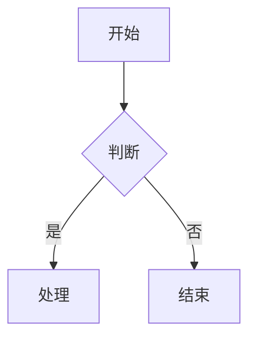

# Markdown 导入技能

从本地 Markdown 文件创建或更新飞书云文档。**支持 Mermaid 图表转飞书画板、大表格自动拆分**。

## 核心特性

1. **Mermaid → 飞书画板**：Mermaid 代码块自动转换为飞书画板（推荐使用 Mermaid 画图）
2. **大表格自动拆分**：超过 9 行的表格自动拆分为多个表格，每个保留表头
3. **表格列宽自动计算**：根据内容智能计算列宽（中英文区分，最小 80px，最大 400px）
4. **API 限流处理**：自动重试，避免 429 错误
5. **Mermaid 服务端错误重试**：500 错误时自动重试 3 次（指数退避）

## 核心概念

**Markdown 作为中间态**：本地文档与飞书云文档之间通过 Markdown 格式进行转换。

## 使用方法

```bash
# 创建新文档
/feishu-import ./document.md --title "文档标题"

# 更新已有文档
/feishu-import ./document.md --document-id <existing_doc_id>

# 上传本地图片
/feishu-import ./document.md --title "带图文档" --upload-images
```

## 执行流程

### 创建新文档

1. **验证文件**
   - 检查 Markdown 文件是否存在
   - 预览文件内容

2. **执行导入**
   ```bash
   feishu-cli doc import <file.md> --title "<title>" [--upload-images]
   ```

3. **添加权限**
   ```bash
   feishu-cli perm add <document_id> --doc-type docx --member-type email --member-id user@example.com --perm full_access
   ```

4. **发送通知**
   通知用户文档已创建

### 更新已有文档

1. **执行更新**
   ```bash
   feishu-cli doc import <file.md> --document-id <doc_id> [--upload-images]
   ```

2. **通知用户**

## 参数说明

| 参数 | 说明 | 默认值 |
|------|------|--------|
| markdown_file | Markdown 文件路径 | 必需 |
| --title | 新文档标题 | 文件名 |
| --document-id | 更新已有文档 | 创建新文档 |
| --upload-images | 上传本地图片 | 否 |

## 支持的 Markdown 语法

- 标题（# ~ ######）
- 段落文本
- 无序/有序列表
- 任务列表（- [ ] / - [x]）
- 代码块（带语言标识）
- **Mermaid 图表** → 自动转换为飞书画板
- 引用块
- 分割线
- **表格**（超过 9 行自动拆分）
- 粗体、斜体、删除线、行内代码
- 链接

### Mermaid 图表示例（推荐使用）

````markdown

````

支持的图表类型（全部已验证）：
- ✅ flowchart（流程图，支持 subgraph 嵌套）
- ✅ sequenceDiagram（时序图）
- ✅ classDiagram（类图）
- ✅ stateDiagram-v2（状态图）
- ✅ erDiagram（ER 图）
- ✅ gantt（甘特图）
- ✅ pie（饼图）

## 输出格式

```
已导入文档！
  文档 ID: <document_id>
  文档链接: https://feishu.cn/docx/<document_id>
  导入块数: 25
```

## 示例

```bash
# 创建新文档
/feishu-import ./meeting-notes.md --title "会议纪要"

# 更新现有文档
/feishu-import ./updated-spec.md --document-id <document_id>

# 带图片导入
/feishu-import ./blog-post.md --title "博客文章" --upload-images
```

## 已验证功能

以下导入功能已通过测试验证（2026-01-27）：

| Markdown 语法 | 导入状态 | 说明 |
|--------------|---------|------|
| 标题（# ~ ######） | ✅ 正常 | |
| 段落文本 | ✅ 正常 | |
| 无序列表 | ✅ 正常 | |
| 有序列表 | ✅ 正常 | |
| 任务列表 | ✅ 正常 | |
| 代码块 | ✅ 正常 | |
| **Mermaid 图表** | ✅ 正常 | 自动转为飞书画板 |
| 引用块 | ✅ 正常 | |
| 分割线 | ✅ 正常 | |
| **粗体**/`*斜体*` | ✅ 正常 | |
| 行内代码 | ✅ 正常 | |
| **表格** | ✅ 正常 | 超过9行自动拆分 |

### 大规模测试结果

已验证可成功导入的大型文档（2026-01-28）：
- **10,000+ 行 Markdown** ✓
- **127 个 Mermaid 图表** → 全部成功转换为飞书画板 ✓
- **170+ 个表格**（含大表格拆分、列宽自动计算）→ 全部成功 ✓
- **7 种图表类型** → flowchart/sequenceDiagram/classDiagram/stateDiagram/erDiagram/gantt/pie 全部成功 ✓

### 最新修复（2026-01-28）

- **表格列宽自动计算**：根据内容智能计算列宽，避免内容拥挤
- **表格空行修复**：修复了飞书 API 自动创建空文本块导致的重复行问题
- **Mermaid 重试机制**：服务端 500 错误时自动重试 3 次

**测试命令**：
```bash
feishu-cli doc import report.md --title "技术报告" --verbose
# 输出: 添加块数: 2089, 表格: 236成功, Mermaid: 77/77成功
```

### 技术说明

Mermaid 图表通过飞书画板 API 导入：
- API 端点：`/open-apis/board/v1/whiteboards/{id}/nodes/plantuml`
- `syntax_type=2` 表示 Mermaid 语法
- `diagram_type` 使用整数（0=auto, 6=flowchart 等）
