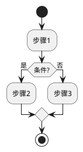
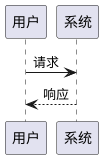
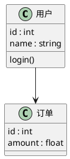
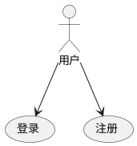
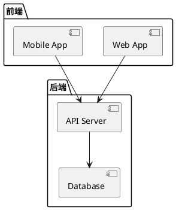
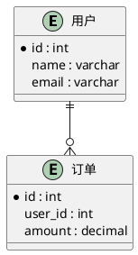
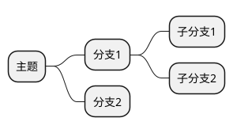

# 飞书 PlantUML 生成技能

生成适配飞书画板的 PlantUML 图表，严格使用安全子集语法。

## PlantUML vs Mermaid 选择

本项目同时支持 PlantUML 和 Mermaid，选择建议：

| 场景 | 推荐 | 原因 |
|------|------|------|
| 流程图、时序图、类图、ER 图、甘特图、饼图、思维导图、状态图 | **Mermaid** | 飞书原生支持更好，成功率更高 |
| 用例图、组件图、活动图（复杂分支） | **PlantUML** | Mermaid 不支持这些图类型 |
| 需要精确控制图表布局 | **PlantUML** | 语法更灵活 |

**默认推荐 Mermaid**，仅在 Mermaid 不支持的图类型时才使用 PlantUML。

## 图类型判断

根据用户描述自动选择图类型：

| 用户描述关键词 | 图类型 |
|---------------|--------|
| 流程/步骤/审批/规则 | 活动图/流程图 |
| 调用链/接口交互/消息顺序 | 时序图 |
| 角色-功能 | 用例图 |
| 结构/类/关系 | 类图 |
| 组件/模块/技术路线图 | 组件图 |
| 架构图/分层架构 | 组件图（无 ArchiMate） |
| 实体/字段/表关系 | ER 图 |
| 思维导图/层级梳理 | 思维导图 |

## 安全子集规则

### 必须遵守

- 使用 `@startuml` / `@enduml` 包裹（思维导图用 `@startmindmap` / `@endmindmap`）
- **不要使用行首缩进**——飞书画板将缩进的行视为独立行，导致解析失败。所有代码必须顶格书写（package/class 内部内容除外）
- 避免 `skinparam` 样式指令
- 避免 `!define` 预处理/宏指令
- 避免颜色、字体、对齐控制
- 避免方向控制指令（如 `left to right direction`）

### 各图类型语法

#### 活动图/流程图



#### 时序图



#### 类图



注意：避免可见性标记（`+` `-` `#` `~`）

#### 用例图



#### 组件图



#### ER 图



#### 思维导图



## 使用流程

1. **分析用户需求**：确定图类型
2. **生成 PlantUML**：遵循安全子集
3. **输出代码块**：仅输出一个代码块
4. **说明变更**：如有降级或移除，简要说明

## 导入到飞书文档

生成的 PlantUML 可以通过以下方式使用：

### 方式一：飞书画板直接粘贴

1. 在飞书文档中插入画板
2. 点击"PlantUML"
3. 粘贴生成的代码

### 方式二：通过 Markdown 导入

在 Markdown 中使用 plantuml 代码块：

````markdown

````

然后使用 `feishu-cli doc import` 导入。

## 输出规范

- 只输出一个 PlantUML 代码块
- 代码块外简短说明修改点（如有降级）
- 不输出多余的伪代码
- 输出时不要包含行首缩进

## 常见问题

### 渲染失败

1. 检查是否有行首缩进
2. 检查是否使用了不支持的语法
3. 简化图表复杂度

### ArchiMate 不支持

飞书画板 PlantUML 版本较旧，ArchiMate sprite 不完整。建议改用组件图。

## 权限要求

- `board:board` - 画板读写（PlantUML 通过画板 API 导入）
- `docx:document` - 文档读写（通过 Markdown 导入时需要）

