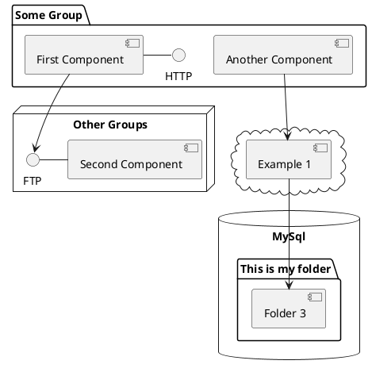

# 飞书画板 PlantUML 安全子集

## 全局安全语法

仅使用这些基础语法：
- @startuml / @enduml
- title ...（不要缩进；如报错直接移除）
- caption ...（可选）
- 注释：' comment 或 /' ... '/

避免：
- skinparam 与样式指令
- 颜色、字体、对齐、布局微调
- 预处理/宏（如 `!define`）
- 行首缩进（粘贴时可能导致解析失败）
- 方向控制指令（如 `left to right direction`）

## 流程图与活动图

- start / stop / end
- :动作文本;
- if (...) then (...) / else / endif
- repeat / repeat while (...)
- fork / fork again / end fork（可选）
- |泳道| 可能失效，若不稳定请禁用

## 时序图

- participant / actor
- A -> B: msg
- B --> A: msg
- activate A / deactivate A
- note left/right of A: ...
- note over A,B: ...
- alt / else / end
- opt / end
- loop / end

注意：
- 参与者颜色可能不渲染
- 文本对齐控制可能被忽略

## 用例图

- actor 用户
- (登录)
- 用户 --> (登录)
- (A) ..> (B) : <<include>>
- (A) ..> (B) : <<extend>>

## 类图

- class A
- class A { field : type  method() }
- interface I
- B --|> A
- A --> B
- A o-- B
- A *-- B
- A ..|> I
- package X { ... }（若渲染异常就移除）

注意：
- 类成员块可用，但建议仅使用最简写法
- 成员行不加可见性标记（如 `+` `-` `#` `~`）
- 成员行格式用 `field : type` 或 `method()`

## 组件图/部署式分组图

- 组件盒子：`[Component]`
- 分组容器：`package "Group" { ... }`
- 节点容器：`node "Node" { ... }`
- 其他容器：`cloud { ... }` / `database "DB" { ... }` / `folder "Folder" { ... }` / `frame "Frame" { ... }`
- 关系：`A --> B` / `A -- B`

注意：
- 避免复杂样式与对齐控制
- 行首缩进可能导致粘贴解析失败

组件图模板：

## ER 图

- entity 用户 { *id : int  name : varchar }
- 关系箭头：-- 或 -->

## 思维导图

- 使用 `@startmindmap` / `@endmindmap`
- 仅使用最基础层级（`*` 或 `+` 递进）

注意：
- 避免复杂样式与嵌套代码块
- 若 mindmap 语法不生效，改用活动图/流程图模拟树形结构

## ArchiMate 注意事项

- 飞书画板 PlantUML 版本较旧（约 1.2023.13），ArchiMate sprite 不完整
- 出现 `No such internal sprite` 时，移除对应 sprite
- 建议改用组件图表达架构
