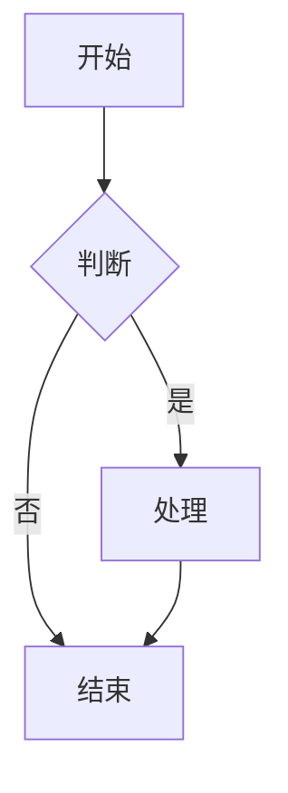
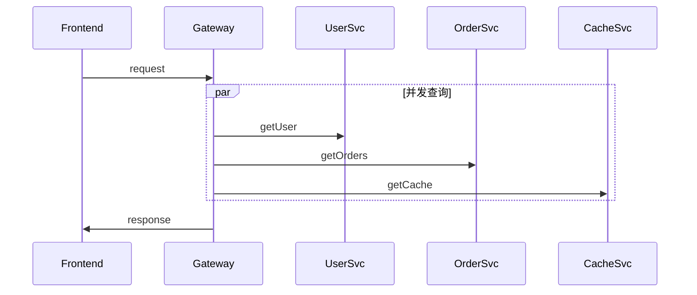

# Mermaid / PlantUML 引擎选型

飞书画板支持两种 Mermaid 渲染引擎，分别对应 `feishu-cli board import` 的两种模式：

- **`--engine server`**（默认）：飞书服务端解析渲染
- **`--engine local`**：本地 `@larksuite/whiteboard-cli` 翻译 + `create-notes` 上传

两者输出结构、可编辑性、错误处理完全不同。本文档说明何时该用哪个。

---

## 选型矩阵

| 维度 | `--engine server` | `--engine local` |
|------|-------------------|------------------|
| **底层调用** | `POST /board/v1/whiteboards/<id>/nodes/plantuml` | `whiteboard-cli -t openapi` + `POST /nodes` |
| **依赖** | 仅 feishu-cli | 还需 `npm i -g @larksuite/whiteboard-cli` |
| **节点结构** | 1 个 `section` 分组（保存 `syntax.code` 源码）+ 原生子节点（composite_shape / connector / life_line / mind_map 等） | N 个顶层原生节点，无 section、不保存源码 |
| **取回源码** | ✅ `board export-code --source` | ❌ |
| **复杂语法** | 2026-10 复测 par、12 participant、3 层嵌套 alt 均可渲染 | 同样可以 |
| **失败处理** | 限流/5xx 自动重试，重试前回读去重；Parse error 直接报错（`board import` 不降级为代码块） | 单次转换，无重试 |
| **幂等** | 不收 client_token | `--client-token` 重跑不重复建节点 |
| **z_index / 裁剪** | 服务端处理 | 不赋 z_index、不裁剪 |
| **速度** | 1 次 HTTP，~1-3s | 翻译 ~1s + 1 次上传 |

**经验法则**：

- 标准 Mermaid（思维导图 / 时序图 / 类图 / 饼图 / 流程图 / 甘特图） → 默认 `server`
- 服务端返回 Parse error / Invalid request parameter → 改 `local`
- 不想要 section 分组、需要离线转换后检查节点 JSON → `local`
- CLI 的复杂度警告（建议改 `--engine local` 或 svg-import）是保守提示，先照常走 `server`，真失败再切；
  不要按提示改用 `svg-import`（那会把整图变成一个不可拆的 svg 节点）

---

## 何时切到 `--engine local`

服务端返回 Parse error 或 `Invalid request parameter`（超出服务端 Mermaid 子集的语法）时切换；这类错误重试无用。

早期实测 par、≥10 participant、≥3 层 alt、≥30 长标签行会让服务端失败；2026-10 在测试租户复测 par（含 `and`）、
12 个 participant、3 层嵌套 alt 都能正常渲染，所以这些只作为"可能失败"的信号，不再是必须切换的条件。

---

## CLI 内置复杂度警告

feishu-cli 在 `board import --syntax mermaid --engine server`（默认）时会**自动诊断**复杂度，向 stderr 输出警告：

```bash
$ feishu-cli board import $BOARD_ID complex_seq.mmd --syntax mermaid
⚠ Mermaid 复杂度警告: 含 par 语法 2 次（飞书服务端不支持）
  服务端可能渲染失败，建议改 --engine local 或改用 svg-import
```

检测维度：

- `par ` 出现次数 → ≥ 1 立即警告
- `participant` 出现次数 → ≥ 10 警告
- `alt ` / `\nalt` 出现次数 → ≥ 3 警告
- 长行（>60 字符）数 → ≥ 30 警告

警告**不阻断执行**，只是 stderr 提示。`board import` 失败时直接报错退出，不会降级为代码块（降级只发生在 `doc import`）。

---

## 实例对比

### 示例 1：标准 flowchart（两种引擎都 OK）



| 引擎 | 节点数 | 类型分布 |
|------|--------|---------|
| server | 9（实测） | section: 1, composite_shape: 4, connector: 4 |
| local | 8（实测） | composite_shape: 4, connector: 4 |

两者都是原生节点；`server` 额外有 section 分组并保存源码，后续可 `export-code --source` 取回修改。

### 示例 2：含 par 的 sequenceDiagram



- `server`：2026-10 复测可正常渲染（section 内含 life_line、connector 与 `combined_fragment`），CLI 仍会打印 par 复杂度警告
- `local`：whiteboard-cli 同样输出 life_line + connector + combined_fragment

### 示例 3：架构图（建议直接走路径 E 或 SVG）

如果是 6 个微服务 + 数据库 + 队列的架构图，**不要**用 Mermaid（即使能渲染，布局也不好看）：

- 推荐 1：手写 nodes.json 用 `create-notes` 精排（路径 E）
- 推荐 2：Python 程序化生成 SVG（极坐标 / 分层）后 `board import --syntax svg`（路径 C）

---

## 安装本地引擎

```bash
npm i -g @larksuite/whiteboard-cli
whiteboard-cli --version    # 0.2.x +
```

注意：不需要任何 token，纯本地翻译；升级 whiteboard-cli 后先用小图核对节点输出。

---

## 本地引擎工作原理

```
feishu-cli board import <id> diagram.mmd --syntax mermaid --engine local
       │
       ▼
WhiteboardCLIBridgeAvailable()   ← 检查 whiteboard-cli 在 PATH 中
       │
       ▼
RenderDiagramToOpenAPINodes(source, "mermaid", asFile=true)
       │
       │   1. tempfile 写入源码（如不是文件路径）
       │   2. spawn: whiteboard-cli -i <input> -t openapi -o <tmp.json>
       │   3. 解析输出 JSON，归一化为节点数组
       ▼
client.CreateBoardNodes(boardID, nodesJSON, ...)
       │
       │   注意：CLI 不自动修 z_index / 不修剪 viewBox 溢出
       │   如需 3 大陷阱修复，请用 scripts/svg_to_board.py
       ▼
输出 node_count + node_ids（-o json）
```

**注意**：`board import --engine local` 不像 `scripts/svg_to_board.py` 那样自动修 z_index 和裁剪溢出节点。如果你发现渲染异常，先看 `references/pitfalls.md`；SVG 改用 `board import --syntax svg` 或 `scripts/svg_to_board.py`。

---

## 失败降级策略

`feishu-cli doc import xxx.md` 自动处理 Markdown 中的 ```mermaid 块：

1. **Phase 1**：顺序创建 N 个画板占位块
2. **Phase 2**：并发 worker（默认 5）调用 ImportDiagram（server engine）
3. **Phase 3**：失败的图表自动降级为代码块（删空画板块 + 插原文 code block）

如果你想在 Markdown 里强制走 local engine，目前没有 fence flag，需要：
- 把 ```mermaid 改为 ```svg fence + 自己用 Python 把 Mermaid 渲染成 SVG（不推荐，绕得太远）
- 或者：先用 `doc create` 建文档 + `doc add-board` 加画板 + `board import --engine local` 单张处理

---

## 一句话总结

| 场景 | 用什么 |
|------|-------|
| 标准 Mermaid，展示用 | `server`（默认） |
| 服务端 Parse error / Invalid request parameter | `local` |
| par / 10+ participant / 30+ 长标签 | 先 `server`（CLI 会警告），失败再 `local` |
| 不是 Mermaid 表达不出的视觉 | 改走路径 C：SVG → 原生节点 |
