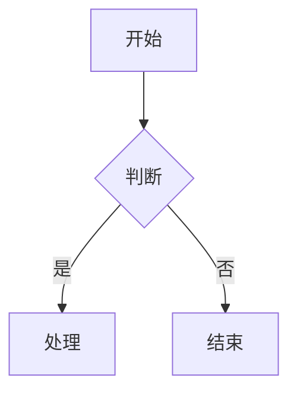
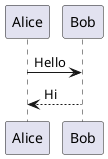

# 飞书文档写入技能

创建或更新飞书云文档，通过 Markdown 作为中间格式。**支持 Mermaid/PlantUML 图表自动转飞书画板**。

## 核心概念

**Markdown 作为中间态**：本地文档与飞书云文档之间通过 Markdown 格式进行转换，中间文件存储在 `/tmp` 目录中。

## 使用方法

```bash
# 创建新文档
/feishu-write "文档标题"

# 更新已有文档
/feishu-write <document_id>
```

## 执行流程

### 创建新文档

1. **收集内容**
   - 与用户确认文档标题
   - 收集用户提供的内容或根据对话生成内容

2. **生成 Markdown**
   - 在 `/tmp/feishu_write_<timestamp>.md` 创建 Markdown 文件
   - 使用标准 Markdown 语法

3. **导入到飞书**
   ```bash
   feishu-cli doc import /tmp/feishu_write_<timestamp>.md --title "文档标题"
   ```

4. **添加权限**（可选，给指定用户添加 full_access）
   ```bash
   feishu-cli perm add <document_id> --doc-type docx --member-type email --member-id user@example.com --perm full_access
   ```

5. **通知用户**
   - 提供文档链接
   - 发送飞书消息通知

### 更新已有文档

1. **先读取现有内容**
   ```bash
   feishu-cli doc export <document_id> --output /tmp/feishu_existing.md
   ```

2. **修改内容**
   - 根据用户需求修改 Markdown 文件

3. **重新导入**
   ```bash
   feishu-cli doc import /tmp/feishu_updated.md --document-id <document_id>
   ```

## 支持的 Markdown 语法

| 语法 | 飞书块类型 | 说明 |
|------|-----------|------|
| `# 标题` | Heading1-6 | |
| `普通文本` | Text | |
| `- 列表项` | Bullet | 支持缩进嵌套 |
| `1. 有序项` | Ordered | 支持缩进嵌套 |
| `- [ ] 任务` | Todo | |
| `` ```code``` `` | Code | |
| `` ```mermaid``` `` | **Board（画板）** | **推荐使用** |
| `` ```plantuml``` `` / `` ```puml``` `` | **Board（画板）** | PlantUML 图表 |
| `> 引用` | QuoteContainer | 支持嵌套引用 |
| `> [!NOTE]` 等 | **Callout（高亮块）** | 6 种类型 |
| `---` | Divider | |
| `**粗体**` | 粗体样式 | |
| `*斜体*` | 斜体样式 | |
| `~~删除线~~` | 删除线样式 | |
| `<u>下划线</u>` | 下划线样式 | |
| `` `行内代码` `` | 行内代码样式 | |
| `$公式$` | **行内公式** | 支持一段多个公式 |
| `$$公式$$` | **块级公式** | 独立公式行 |
| `[链接](url)` | 链接 | |
| `| 表格 |` | Table | 超过9行自动拆分，列宽自动计算 |

### 推荐：使用 Mermaid / PlantUML 画图

在文档中画图时，**推荐使用 Mermaid**（也支持 PlantUML），会自动转换为飞书画板：

````markdown

````

````markdown

````

支持的 Mermaid 图表类型：
- ✅ flowchart（流程图，支持 subgraph）
- ✅ sequenceDiagram（时序图）
- ✅ classDiagram（类图）
- ✅ stateDiagram-v2（状态图）
- ✅ erDiagram（ER 图）
- ✅ gantt（甘特图）
- ✅ pie（饼图）
- ✅ mindmap（思维导图）

**Mermaid 注意事项**：
- 避免在节点标签中使用 `{}` 花括号（如 `{version}`），会触发解析错误
- **禁止使用 `par...and...end`**，飞书解析器完全不支持，改用 `Note over X: 并行执行...`
- sequenceDiagram 渲染复杂度组合超限：10+ participant + 2+ alt 块 + 30+ 长消息标签会触发服务端 500
- 安全阈值：participant ≤8、alt ≤1、消息标签尽量简短
- 导入失败的图表会自动降级为代码块展示

### Callout 高亮块

在文档中使用 Callout 语法创建飞书高亮块：

````markdown
> [!NOTE]
> 提示信息。

> [!WARNING]
> 警告信息。

> [!TIP]
> 技巧提示。

> [!CAUTION]
> 警示信息。

> [!IMPORTANT]
> 重要信息。

> [!SUCCESS]
> 成功信息。
````

Callout 内支持多行文本和子块（列表等）。

### 公式

````markdown
行内公式：圆面积 $S = \pi r^2$，周长 $C = 2\pi r$。

块级公式：
$$\int_{0}^{\infty} e^{-x^2} dx = \frac{\sqrt{\pi}}{2}$$
````

## 输出格式

创建/更新完成后报告：
- 文档 ID
- 文档 URL：`https://feishu.cn/docx/<document_id>`
- 操作状态

## 示例

```bash
# 创建新的会议纪要
/feishu-write "2024-01-21 周会纪要"

# 更新现有文档
/feishu-write <document_id>
```
